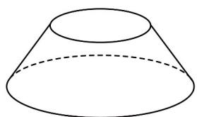

题型三 柱、圆锥、圆台的表面积和体积（共5小题）

11. 降雨量是在一定时间内降落在水平地面上某一单位面积上的水层深度（未经蒸发、渗漏、流失），以

mm 计算 $^{24h}$ 降雨量的等级划分如下：

<table><tr><td>降雨量</td><td>0.1~9.9</td><td>10~24.9</td><td>25~49.9</td><td>50~99.9</td><td>100~249.9</td><td>250</td></tr><tr><td>等级</td><td>小雨</td><td>中雨</td><td>大雨</td><td>暴雨</td><td>大暴雨</td><td>特大暴雨</td></tr></table>

某数学小组为了测量当地某日的降雨量，用一个开口半径为 $50\mathrm{mm}$ ，底面半径为 $100\mathrm{mm}$ ，高为 $50\mathrm{mm}$ 的

圆台型铁桶（如图所示）收集雨水，若在一次降水过程中用此桶水平放置接了 $24\mathrm{h}$ 的雨水后，桶内水深为

20mm，则当日降雨量的等级是（）

A. 暴雨 B. 大雨 C. 中雨 D. 小雨

【答案】A

【分析】根据相似三角形求出水面半径，根据圆台体积公式求出桶内水的体积，用桶的开口面积作为接雨面积求出降雨量，结合24h降雨量的等级划分判断等级即可.

【详解】设水面半径为 R ，

根据三角形相似可得 $\frac{R - 50}{100 - 50} = \frac{50 - 20}{50}$ ，解得 $R = 80\mathrm{mm}$

则 $V = \frac{1}{3} \times 20 \times \left( \pi \times 80^{2} + \sqrt{\pi \times 80^{2} \times \pi \times 100^{2}} + \pi \times 100^{2} \right) = \frac{20}{3} \pi \times 24400 \mathrm{~mm}^{3}$ .

又接雨面积为桶的开口面积 $S = \pi \times 50^{2} = 2500\pi \mathrm{mm}^{2}$

根据降雨量定义， $d = \frac{V}{S} = \frac{\frac{20}{3}\pi\times 24400}{2500\pi} = 65.07$ mm

结合 24h 降雨量的等级划分可得，当日降雨量的等级是暴雨.

![[高中/课堂同步/题库/人教A版高中数学同步讲义(2026)/02_必修第二册/期中专项训练+期中模拟卷/专题21 立体几何初步及复数精选压轴60题12类考点专练（高效培优期中专项训练）数学人教A版高一必修第二册_57404446/题型三_柱_圆锥_圆台的表面积和体积/questions/Q00077464.md]]
![[高中/课堂同步/题库/人教A版高中数学同步讲义(2026)/02_必修第二册/期中专项训练+期中模拟卷/专题21 立体几何初步及复数精选压轴60题12类考点专练（高效培优期中专项训练）数学人教A版高一必修第二册_57404446/题型三_柱_圆锥_圆台的表面积和体积/questions/Q00077465.md]]
![[高中/课堂同步/题库/人教A版高中数学同步讲义(2026)/02_必修第二册/期中专项训练+期中模拟卷/专题21 立体几何初步及复数精选压轴60题12类考点专练（高效培优期中专项训练）数学人教A版高一必修第二册_57404446/题型三_柱_圆锥_圆台的表面积和体积/questions/Q00077466.md]]
![[高中/课堂同步/题库/人教A版高中数学同步讲义(2026)/02_必修第二册/期中专项训练+期中模拟卷/专题21 立体几何初步及复数精选压轴60题12类考点专练（高效培优期中专项训练）数学人教A版高一必修第二册_57404446/题型三_柱_圆锥_圆台的表面积和体积/questions/Q00077467.md]]
