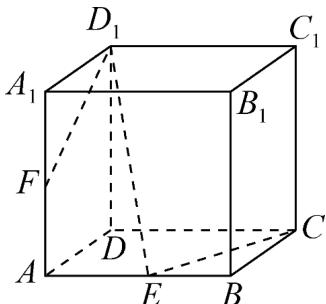

<!-- question-source:start -->
41．如图所示，在正方体 $ABCD - A_{1}B_{1}C_{1}D_{1}$ 中， $E$ ， $F$ 分别是 $AB, AA_{1}$ 的中点．

(1)求证： $CE, D_{1}F, DA$ 三线交于点 P；

(2)在（1）的结论中， $G$ 是 $D_{1}E$ 上一点，若 $FG$ 交平面ABCD于点 $H$ ，求证： $P$ ， $E$ ， $H$ 三点共线.
<!-- question-source:end -->

![[高中/课堂同步/题库/人教A版高中数学同步讲义(2026)/02_必修第二册/期中专项训练+期中模拟卷/专题21 立体几何初步及复数精选压轴60题12类考点专练（高效培优期中专项训练）数学人教A版高一必修第二册_57404446/题型九_空间中线共点及点共线问题/questions/answers/Q00077492A1.md]]
