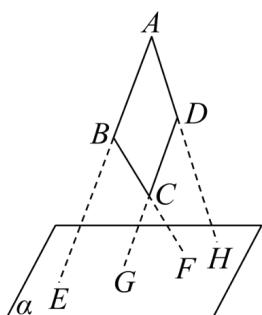

<!-- question-source:start -->
42．如图所示，四边形ABCD中，已知 $AB\|CD$ ，AB，BC，DC，AD(或延长线)分别与平面 $\alpha$ 相交于E

$F, G, H$ ，求证： $E, F, G, H$ 必在同一直线上。

<!-- question-source:end -->

![[高中/课堂同步/题库/人教A版高中数学同步讲义(2026)/02_必修第二册/期中专项训练+期中模拟卷/专题21 立体几何初步及复数精选压轴60题12类考点专练（高效培优期中专项训练）数学人教A版高一必修第二册_57404446/题型九_空间中线共点及点共线问题/questions/answers/Q00077493A1.md]]
