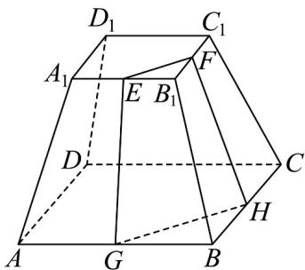

<!-- question-source:start -->
44．如图，在正四棱台 $ABCD - A_{1}B_{1}C_{1}D_{1}$ 中， $E,F,G,H$ 分别为棱 $A_{1}B_{1}$ ， $B_{1}C_{1}$ ， $AB$ ， $BC$ 的中点．

(1)判断直线 $FG$ 与 $EH$ 的位置关系，并说明理由；

(2)证明 $GE$ ，FH， $BB_{1}$ 相交于一点.
<!-- question-source:end -->

![[高中/课堂同步/题库/人教A版高中数学同步讲义(2026)/02_必修第二册/期中专项训练+期中模拟卷/专题21 立体几何初步及复数精选压轴60题12类考点专练（高效培优期中专项训练）数学人教A版高一必修第二册_57404446/题型九_空间中线共点及点共线问题/questions/answers/Q00077495A1.md]]
