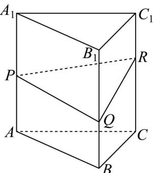
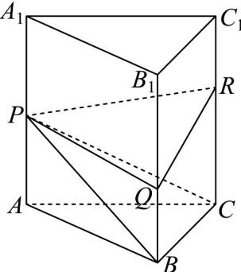

> [!faq]- 《专题21 立体几何初步及复数精选压轴60题12类考点专练（高效培优期中专项训练）数学人教A版高一必修第二册_57404446》官方解析
>
> > [!success]- **【答案】**  A. $\frac{\sqrt{3}}{2}$ B. $\frac{2\sqrt{3}}{3}$ C. $\sqrt{3}$ D. $\frac{4\sqrt{3}}{3}$
>
> > [!note]- **【解析】**
> > 正三棱柱 $ABC-A_{1}B_{1}C_{1}$ 所有棱长为2，底面正VABC的面积 $S=\frac{\sqrt{3}}{4}\times2^{2}=\sqrt{3}$ ，高h=2，由题意得：AP=1， $BQ=\frac{2}{3}$ ， $CR=\frac{4}{3}$ .
> >
> > 如图连接 PB, PC，将几何体 PQR - ABC 分为 $V_{P-ABC}$ 和 $V_{P-BQRC}$ ，
> >
> > 
> >
> > $$
> > V _ {P - A B C} = \frac {1}{3} \times S \times | A P | = \frac {1}{3} \times \sqrt {3} \times 1 = \frac {\sqrt {3}}{3}
> > $$
> >
> > 梯形 BQRC 的面积 $S' = \frac{1}{2} \left( |BQ| + |RC| \right) \cdot |BC| = \frac{1}{2} \left( \frac{2}{3} + \frac{4}{3} \right) \times 2 = 2$
> >
> > 四棱锥 P-BQRC 以 BQRC 为底面的高等于三角形 ABC 的高 $h_{1}=\left|AB\right|\sin60^{\circ}=2\times\frac{\sqrt{3}}{2}=\sqrt{3}$ ，所以 $V_{P-BQRC}=\frac{1}{3}\times S'\times h_{1}=\frac{1}{3}\times2\times\sqrt{3}=\frac{2\sqrt{3}}{3}$
> >
> > 几何体 PQR - ABC 体积为 $V = V_{P-ABC} + V_{P-BQRC} = \frac{\sqrt{3}}{3} + \frac{2\sqrt{3}}{3} = \sqrt{3}$
