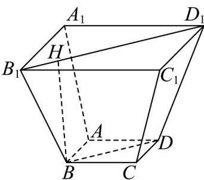

> [!faq]- 《专题21 立体几何初步及复数精选压轴60题12类考点专练（高效培优期中专项训练）数学人教A版高一必修第二册_57404446》官方解析
>
> > [!success]- **【答案】** A. $2\pi$ B. $3\pi$ C. $2(\sqrt{2} - 1)\pi$ D. $3(\sqrt{2} - 1)\pi$
>
> > [!note]- **【分析】**
> > 根据棱锥的结构特点，确定所求的圆柱的高和底面半径.
>
> > [!note]- **【解析】**
> > 设圆柱的上底面圆周与 $PA, PC$ 分别交于点 $E, F, AC$ 中点为 $O, PO$ 交 $EF$ 于点 $O_1$
> >
> > 因为四边形 $ABCD$ 是边长为2的正方形，所以 $OA = \frac{1}{2} AC = \frac{1}{2}\sqrt{2^2 + 2^2} = \sqrt{2}$
> >
> > 由 $PA = 2\sqrt{5}$ ，得 $PO = \sqrt{PA^{2} - AO^{2}} = \sqrt{20 - 2} = 3\sqrt{2}$ .
> >
> > 由题意，圆柱的底面圆与正方形 ABCD 的四边都相切，故其半径 r = 1.
> >
> > 又 $AC = 2\sqrt{2}, EF = 2r = 2, \frac{EF}{AC} = \frac{PO_1}{PO}$
> >
> > 所以 $PO_{1}=3$ ，圆柱的高 $h=OO_{1}=PO-PO_{1}=3\sqrt{2}-3$
> >
> > 所以圆柱的体积为 $\pi r^{2}h = 3\left(\sqrt{2} - 1\right)\pi$
> >
> > 
> >
> > $$
> > 4 \sqrt {5} \mathrm{cm}
> > $$
> >
> > 这个方斗的容积为（ ）A. $1184\sqrt{2}\mathrm{cm}^3$ B. $1184\sqrt{3}\mathrm{cm}^3$ C. $1776\mathrm{cm}^3$ D. $1184\mathrm{cm}^3$
> >
> > 【答案】A
> >
> > 【分析】根据正四棱台的性质求出棱台的高，结合体积公式求解即可.
> >
> > 【详解】画出该正四棱台的直观图，如图所示，
> >
> > 
> >
> > 易得 $B_{1}D_{1} = 16\sqrt{2}\mathrm{cm}$ ， $BD = 12\sqrt{2}\mathrm{cm}$
> >
> > 过 B 作 $BH \perp B_{1}D_{1}$ ，垂足为 H，则 BH 即为该正四棱台的高，
> >
> > $$
> > B _ {1} H = \frac {1 6 \sqrt {2} - 1 2 \sqrt {2}}{2} = 2 \sqrt {2}, B H = \sqrt {\left(4 \sqrt {5}\right) ^ {2} - \left(2 \sqrt {2}\right) ^ {2}} = 6 \sqrt {2}
> > $$
> >
> > 则这个方斗的容积
> >
> > $$
> > V = \frac {1}{3} \times \left(1 6 ^ {2} + 1 2 ^ {2} + \sqrt {1 6 ^ {2} \times 1 2 ^ {2}}\right) \times 6 \sqrt {2} = 1 1 8 4 \sqrt {2} \mathrm{cm} ^ {3}.
> > $$
