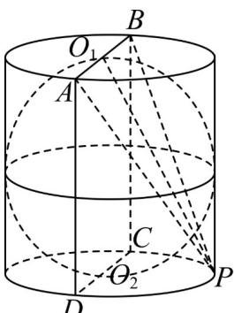
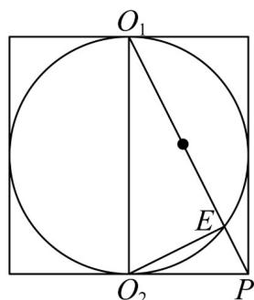

> [!faq]- 《专题21 立体几何初步及复数精选压轴60题12类考点专练（高效培优期中专项训练）数学人教A版高一必修第二册_57404446》官方解析
>
> > [!success]- **【答案】** A. $\frac{\sqrt{15}\pi}{12}$ B. $\frac{2\sqrt{15}\pi}{5}$ C. $\frac{4\sqrt{15}\pi}{5}$ D. $\frac{4\sqrt{5}\pi}{5}$
>
> > [!note]- **【分析】**
> > 根据条件知当球 $O$ 的体积最大时，球与圆柱的上下底面及母线均相切，作出图形后，计算求解截面圆的直径即可.
>
> > [!note]- **【解析】**
> > 由题意知，当球 $O$ 的体积最大时，球与圆柱的上下底面及母线均相切，因为正方形ABCD的面积为12，所以 $AB = BC = 2\sqrt{3}$ ，如图1，记 $AB$ 所在底面的圆心为 $O_{1},CD$ 所在底面的圆心为 $O_{2}$ ，
> >
> > 
> > 图1
> >
> > 
> > 图2
> >
> > 平面 $APB$ 与球 $O$ 的交线为圆形，如图 $2, O_1E$ 即为截面圆的直径，易知 $O_1P = \sqrt{(2\sqrt{3})^2 + (\sqrt{3})^2} = \sqrt{15}, O_1O_2 = 2\sqrt{3}$ ，易知 $\mathrm{Rt}\triangle O_1O_2P - \mathrm{Rt}\triangle O_1EO_2$ ，故 $\frac{O_1E}{O_1O_2} = \frac{O_1O_2}{O_1P}$ ，所以 $O_1E = \frac{O_1O_2^2}{O_1P} = \frac{12}{\sqrt{15}} = \frac{4\sqrt{15}}{5}$ ，所以截面圆周长为 $\pi \cdot O_1E = \frac{4\sqrt{15}\pi}{5}$ 。
