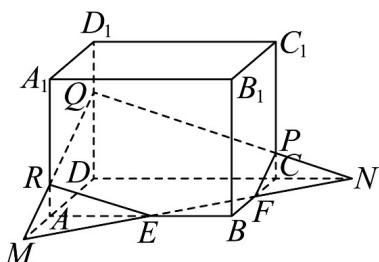

> [!faq]- 《专题21 立体几何初步及复数精选压轴60题12类考点专练（高效培优期中专项训练）数学人教A版高一必修第二册_57404446》官方解析
>
> > [!success]- **【答案】** B
>
> > [!note]- **【分析】**
> > 根据长方体的性质，以及面面相交的概念，判断截面为五边形时的情况，进而判断结果.
>
> > [!note]- **【解析】**
> > 如图所示，
> >
> > 
> >
> > 要使点 $E, F, P$ 所在的截面为五边形，则截面与棱 $DD_{1}$ 相交，
> >
> > 因为 E 是 AB 的中点，所以 AE = EB ，
> >
> > 因为 $\angle AEM = \angle BEF$ ， $\angle MAE = \angle EBF$ ，
> >
> > 所以 $\triangle AEM \cong \triangle BEF$ ，所以 $FB = AM$
> >
> > 在长方体中，CF // DM，所以 $\triangle NCF \sim \triangle NDM$ ，
> >
> > 所以 $\frac{CN}{DN} = \frac{CF}{DM} = \frac{1}{3}$
> >
> > 同理可得 $\triangle NCP\sim \triangle NDQ$ ，即 $\frac{CP}{DQ} = \frac{NC}{ND} = \frac{1}{3}$
> >
> > 因为 $DQ \leq DD_{1}$ ，所以 $\frac{CP}{DD_{1}} \leq \frac{1}{3}$ ，即 $\frac{CP}{CC_{1}} = \frac{CP}{DD_{1}} \leq \frac{1}{3}$ ，所以 $0 < \lambda \leq \frac{1}{3}$
> >
> > 即实数 $\lambda$ 的取值范围是 $\left(0, \frac{1}{3}\right]$ .
> >
> > 故选 **B**.
