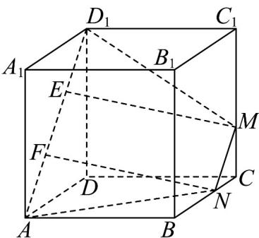

> [!faq]- 《专题21 立体几何初步及复数精选压轴60题12类考点专练（高效培优期中专项训练）数学人教A版高一必修第二册_57404446》官方解析
>
> > [!success]- **【答案】** $2 \sqrt{22}$
>
> > [!note]- **【分析】**
> > 设截面交棱 BC 于点 N ，连接 AN 、 MN ，由面面平行的性质可知 $MN \parallel AD_{1}$ ，可知截面为等腰梯
> >
> > 形 $AD_{1}MN$ ，求出该梯形的高以及上、下底的长，结合梯形的面积公式求解即可.
>
> > [!note]- **【解析】**
> > 设截面交棱 BC 于点 N ，连接 AN 、 MN ，如图所示，
> >
> > 因为平面 $AA_{1}D_{1}D //$ 平面 $BCC_{1}B_{1}$ ，平面 $AD_{1}M \cap$ 平面 $AA_{1}D_{1}D = AD_{1}$
> >
> > 平面 $AD_{1}M \cap$ 平面 $BCC_{1}B_{1} = MN$ ，所以 $MN // AD_{1}$
> >
> > 因为 $AD \parallel BC$ ，由等角定理结合图形可得 $\angle CNM = \angle DAD_{1} = 45^{\circ}$ ，
> >
> > 又因为 $CM \perp CN$ ，故 $\triangle CMN$ 为等腰直角三角形，且 $CN = CM = 1$ ， $MN = \sqrt{2} CM = \sqrt{2}$
> >
> > 易知 $AD_{1} = \sqrt{2} AD = 3\sqrt{2}$ ，且 $AN = \sqrt{AB^2 + BN^2} = \sqrt{3^2 + 2^2} = \sqrt{13}$ ，同理可得 $D_{1}M = \sqrt{13}$
> >
> > 故四边形 $AD_{1}MN$ 为等腰梯形，如下图所示：
> >
> > 
> >
> > 在平面 $AD_{1}MN$ 内分别作 $ME \perp AD_{1}$ ， $NF \perp AD_{1}$ ，垂足分别为点 E、F，
> >
> > 因为 $MN / / EF$ ， $ME\perp AD_1$ ， $NF\perp AD_1$ ，故四边形MNFE为矩形，所以 $ME = NF$
> >
> > 在 $\mathrm{Rt}\triangle ANF$ 和 $\mathrm{Rt}^{\triangle}D_{1}ME$ 中， $AN = D_{1}M$ ， $ME = NF$ ， $\angle NAF = \angle MD_1E$
> >
> > 所以 $\mathrm{Rt}^{\triangle}ANF\cong \mathrm{Rt}^{\triangle}D_{1}ME$
> >
> > 所以 $AF = D_{1}E = \frac{AD_{1} - EF}{2} = \frac{AD_{1} - MN}{2} = \frac{3\sqrt{2} - \sqrt{2}}{2} = \sqrt{2}$
> >
> > 由勾股定理可得 $NF = \sqrt{AN^{2} - AF^{2}} = \sqrt{13 - 2} = \sqrt{11}$ ，
> >
> > 故截面面积为 $S=\frac{(MN+AD_{1})\cdot NF}{2}=\frac{4\sqrt{2}\times\sqrt{11}}{2}=2\sqrt{22}$
> >
> > 故答案为： $2\sqrt{22}$
