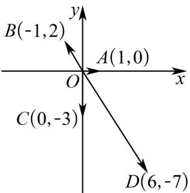

> [!faq]- 《专题21 立体几何初步及复数精选压轴60题12类考点专练（高效培优期中专项训练）数学人教A版高一必修第二册_57404446》官方解析
>
> > [!success]- **【答案】** （1）答案见解析；（2）图象见解析；（3）-3-2i
>
> > [!note]- **【分析】**
> > （1）由复数的向量表示可得；（2）由复数的坐标表示可得；（3）设 $OD = (x, y)$ ，由复数的向
> >
> > 量和坐标表示计算可得.
>
> > [!note]- **【解析】**
> > （1） $\overline{OM}$ 表示的复数为 $1+3i$ ； $\overline{ON}$ 表示的复数为 4-i； $\overline{OP}$ 表示的复数为 2i； $\overline{OQ}$ 表示的复数
> >
> > 为-4.
> >
> > (2) 设复数 1 对应的向量为 $OA$ ，其中 $A(1,0)$ ;
> >
> > 复数 $-1+2i$ 对应的向量为 OB，其中 $B(-1,2)$ ;
> >
> > 复数-3i对应的向量为 $OC$ ，其中 $C(0, -3)$ ；
> >
> > 复数6-7i对应的向量为 $OD$ ，其中 $D(6,-7)$
> >
> > 如图所示：
> >
> > 
> >
> > (3) 记 O 为复平面的原点，由题意得 $OA = (2, 3)$ , OB = (3, 2), OC = (-2, -3)
> >
> > 设 $OD=(x,y)$ ，则 $AD=(x-2,y-3)$ ， $BC=(-5,-5)$
> >
> > 由题意知， $\overset{\cup\cup\cup}{AD}=\overset{\cup\cup\cup}{BC}$ ，所以 $\left\{\begin{aligned}x-2&=-5,\\ y-3&=-5,\end{aligned}\right.$ 即 $\left\{\begin{aligned}x&=-3,\\ y&=-2,\end{aligned}\right.$
> >
> > 故点 D 对应的复数为 -3 - 2i .
