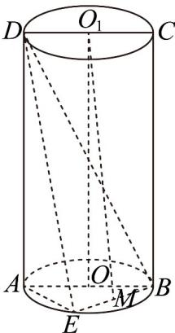

<!-- question-source:start -->
28. 如图，矩形 $ABCD$ 是圆柱 $OO_{1}$ 的轴截面， $AB = 2$ ， $AD = 4$ ， $E$ 为 $AB$ 的中点， $M$ 为 $BE$ 的中点，则（

A. 圆柱 $OO_{1}$ 的侧面积为 $16\pi$

B. 圆柱 $OO_{1}$ 的外接球的表面积为 $32\pi$

C. $O_{1}M / /$ 平面ADE

D．异面直线 $O_{1}M$ 与 $_{BC}$ 所成角的正切值为 $\frac{\sqrt{2}}{8}$
<!-- question-source:end -->

![[高中/课堂同步/题库/人教A版高中数学同步讲义(2026)/02_必修第二册/期中专项训练+期中模拟卷/专题21 立体几何初步及复数精选压轴60题12类考点专练（高效培优期中专项训练）数学人教A版高一必修第二册_57404446/题型六_异面直线所成的角的求算问题/questions/answers/Q00077479A1.md]]
