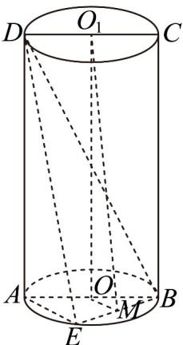

> [!faq]- 《专题21 立体几何初步及复数精选压轴60题12类考点专练（高效培优期中专项训练）数学人教A版高一必修第二册_57404446》官方解析
>
> > [!success]- **【答案】** CD
>
> > [!note]- **【分析】**
> > 根据圆柱侧面积的求法，代入数据，可判断 A 的正误；由题意外接球的球心为 $OO_{1}$ 的中点，根
> >
> > 据勾股定理，求出外接球半径 $R$ ，代入公式，可判断B的正误；根据面面平行的判定定理，可证平面
> >
> > $OO_{1}M//$ 平面 ADE，根据面面平行的性质定理，即可判断 C 的正误；分析可得 $\angle OO_{1}M$ 即为异面直线
> >
> > $O_{1}M$ 与 BC 所成角，求出所需长度，根据三角函数的定义，即可判断 D 的正误.
>
> > [!note]- **【解析】**
> > 选项 A：因为矩形 ABCD 为轴截面，且 AB = 2 ， AD = 4
> >
> > 所以圆柱 $OO_{1}$ 的侧面积 $S = 2\pi \times \frac{AB}{2} \times AD = 8\pi$ ，故 A 错误；
> >
> > 选项 B：根据对称性得，外接球的球心为 $OO_{1}$ 的中点，设外接球的半径为 R，
> >
> > 则 $R^2 = \left(\frac{AB}{2}\right)^2 +\left(\frac{AD}{2}\right)^2 = 5$
> >
> > 所以圆柱 $OO_{1}$ 的外接球的表面积 $S_{1}=4\pi R^{2}=20\pi$ ，故 B 错误；
> >
> > 选项 C：连接 OM，因为 O、M 分别为 BA、BE 的中点，
> >
> > 所以 OM //AE ，
> >
> > 又 $OO_{1}//AD$ ， $OM\cap OO_{1}=O,OM,OO_{1}\subset$ 平面 $OO_{1}M$ ， $AE\cap AD=A,AE,AD\subset$ 平面ADE，
> >
> > 所以平面 $OO_{1}M \parallel$ 平面 ADE ，
> >
> > 因为 $O_{1}M \subset$ 平面 $OO_{1}M$
> >
> > 所以 $O_{1}M / /$ 平面ADE，故C正确；
> >
> > 
> >
> > 选项 D：因为 $OO_{1}//BC$ ，所以 $\angle OO_{1}M$ 即为异面直线 $O_{1}M$ 与 BC 所成角，
> >
> > 在 $\mathrm{Rt}\triangle OO_1M$ 中， $OM = \frac{\sqrt{2}}{2},OO_{1} = 4$
> >
> > 所以 $\tan\angle OO_{1}M=\frac{OM}{OO_{1}}=\frac{\sqrt{2}}{8}$ ，则异面直线 $O_{1}M$ 与 BC 所成角的正切值为 $\frac{\sqrt{2}}{8}$ ，故 D 正确.
