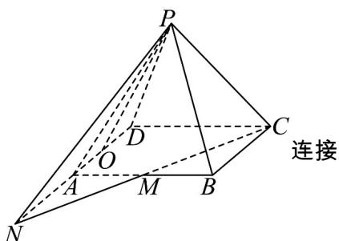
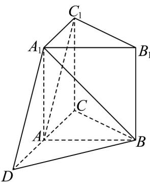

> [!faq]- 《专题21 立体几何初步及复数精选压轴60题12类考点专练（高效培优期中专项训练）数学人教A版高一必修第二册_57404446》官方解析
>
> > [!success]- **【答案】** B
>
> > [!note]- **【分析】**
> > 延长CA到点D，使AD=AC=2，连接 $A_{1}D$ 、BD，可得 $\angle BA_{1}D$ （或其补角）就是异面直线 $A_{1}B$ 与 $AC_{1}$ 所成的角.
>
> > [!note]- **【解析】**
> > 延长CA到点D，使AD=AC=2，连接 $A_{1}D$ 、BD，
> >
> > 因为 $AD//A_{1}C_{1}$ 且 $AD=A_{1}C_{1}$ ，所以四边形 $ADC_{1}A_{1}$ 是平行四边形，因此 $A_{1}D//AC_{1}$ 所以， $\angle BA_{1}D$ （或其补角）就是异面直线 $A_{1}B$ 与 $AC_{1}$ 所成的角，
> >
> > 在 $\triangle ABC$ 中，AB=AC=2， $\angle BAC=60^{\circ}$ ，所以 $\triangle ABC$ 是等边三角形，BC=2，
> >
> > 直三棱柱中， $A_{1}A=3$ ，则： $A_{1}B=\sqrt{AB^{2}+AA_{1}^{2}}=\sqrt{2^{2}+3^{2}}=\sqrt{13}$ 在 $\triangle ABD$ 中，AD=2，AB=2， $\angle BAD=180^{\circ}-60^{\circ}=120^{\circ}$ 由余弦定理： $BD^{2}=AB^{2}+AD^{2}-2\cdot AB\cdot AD\cdot\cos120^{\circ}=2^{2}+2^{2}-2\times2\times2\times(-\frac{1}{2})=12$ 所以 $BD=2\sqrt{3}$ 在 $\triangle A_{1}BD$ 中， $A_{1}B=A_{1}D=\sqrt{13}$ ， $BD=2\sqrt{3}$
> >
> > 
> >
> > 由余弦定理：
> >
> > $$
> > \cos \angle B A _ {1} D = \frac {A _ {1} B ^ {2} + A _ {1} D ^ {2} - B D ^ {2}}{2 \cdot A _ {1} B \cdot A _ {1} D} = \frac {1 3 + 1 3 - 1 2}{2 \times \sqrt {1 3} \times \sqrt {1 3}} = \frac {1 4}{2 6} = \frac {7}{1 3}
> > $$
> >
> > 
