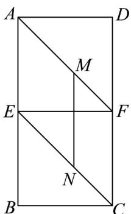
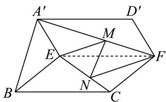

<!-- question-source:start -->
47．如图，在矩形ABCD中，AB=2BC=4，点E,F分别是边AB,CD的中点，点M,N分别在线段
AF,CE 上移动（不含端点），且FM=CN，将四边形AEFD沿EF翻折至四边形 $A^{\prime}EFD^{\prime}$ ，使得二面角 $A^{\prime}-EF-B$ 的大小为 $60^{\circ}$ ·求证：MN//平面 $A^{\prime}BE$

<!-- question-source:end -->

![[高中/课堂同步/题库/人教A版高中数学同步讲义(2026)/02_必修第二册/期中专项训练+期中模拟卷/专题21 立体几何初步及复数精选压轴60题12类考点专练（高效培优期中专项训练）数学人教A版高一必修第二册_57404446/题型十_空间点_直线平面之间的位置关系/questions/answers/Q00077498A1.md]]
