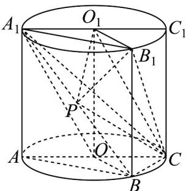

> [!faq]- 《专题21 立体几何初步及复数精选压轴60题12类考点专练（高效培优期中专项训练）数学人教A版高一必修第二册_57404446》官方解析
>
> > [!success]- **【答案】** (1)证明见解析 (2) 2
>
> > [!note]- **【分析】**
> > （1）连接 $OO_{1}$ ，根据题意，分别证得 $OB//$ 平面 $O_{1}B_{1}C$ 和 $A_{1}O//$ 平面 $O_{1}B_{1}C$ ，结合面面平行的判
> >
> > 定定理，即可证得平面 $A_{1}OB \parallel$ 平面 $O_{1}B_{1}C$ ；
> >
> > (2) 由 $A_{1}B //$ 平面 $O_{1}B_{1}C$ ，得到三棱锥 $P-O_{1}B_{1}C$ 的体积等于三棱锥 $A_{1}-O_{1}B_{1}C$ 的体积，利用
> >
> > $V_{A_{1}-O_{1}B_{1}C}=V_{C-A_{1}O_{1}B_{1}}$ ，结合锥体的体积公式，即可求解.
>
> > [!note]- **【解析】**
> > （1）证明：如图所示，连接 $OO_{1}$ ，由四边形 $OO_{1}B_{1}B$ 为矩形，所以 $OB//O_{1}B_{1}$
> >
> > 因为 $O_{1}B_{1}\subset$ 平面 $O_{1}B_{1}C$ ， $OB\not\subset$ 平面 $O_{1}B_{1}C$ ，所以 $OB / /$ 平面 $O_{1}B_{1}C$
> >
> > 又因为四边形 $OCO_{1}A_{1}$ 为平行四边形，所以 $A_{1}O//O_{1}C$
> >
> > 因为 $O_{1}C \subset$ 平面 $O_{1}B_{1}C$ ， $A_{1}O \not\subset$ 平面 $O_{1}B_{1}C$ ，所以 $A_{1}O //$ 平面 $O_{1}B_{1}C$ ，
> >
> > 因为 $OB \cap A_{1}O = O$ ，且 $OB, A_{1}O \subset$ 平面 $A_{1}OB$ ，所以平面 $A_{1}OB //$ 平面 $O_{1}B_{1}C$ 。
> >
> > (2) 解：由 $A_{1}B \subset$ 平面 $A_{1}OB$ 及 (1) 知 $A_{1}B //$ 平面 $O_{1}B_{1}C$
> >
> > 所以点 P 到平面 $O_{1}B_{1}C$ 的距离等于点 $A_{1}$ 到平面 $O_{1}B_{1}C$ 的距离，
> >
> > 所以三棱锥 $P - O_{1}B_{1}C$ 的体积等于三棱锥 $A_{1} - O_{1}B_{1}C$ 的体积，
> >
> > 因为 $V_{A_{1}-O_{1}B_{1}C}=V_{C-A_{1}O_{1}B_{1}}$ ，因为 AC 为圆 O 的直径，可得 $\angle ABC=90^{\circ}$ ，
> >
> > 又因为 $\angle BAC = 30^{\circ}$ ， $AC = 4$ ，所以 $A_{1}B_{1} = AB = 2\sqrt{3}$ ， $A_{1}O_{1} = AO = 2$
> >
> > 且 $\angle B_{1}A_{1}O_{1} = \angle BAC = 30^{\circ}$ $CC_{1} = AA_{1} = AB = 2\sqrt{3}$
> >
> > 所以 $V_{C-A_{1}O_{1}B_{1}}=\frac{1}{3}\times\frac{1}{2}\times2\times2\sqrt{3}\sin30^{\circ}\times2\sqrt{3}=2$
> >
> > 所以三棱锥 $P-O_{1}B_{1}C$ 的体积为 2.
> >
> > 
