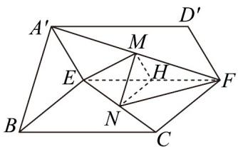

> [!faq]- 《专题21 立体几何初步及复数精选压轴60题12类考点专练（高效培优期中专项训练）数学人教A版高一必修第二册_57404446》官方解析
>
> > [!success]- **【答案】** 证明见解析
>
> > [!note]- **【分析】**
> > 过点 $M$ 作 $MH // A'E$ ，交线段 $EF$ 于 $H$ ，先证平面 $MNH //$ 平面 $A'BE$ ，再根据面面平行证线面
> >
> > 平行.
>
> > [!note]- **【解析】**
> > 过点 M 作 $MH \parallel A'E$ ，交线段 EF 于 H，
> >
> > 如图：
> >
> > 
> >
> > 因为 $A^{\prime}E \subset$ 平面 $A^{\prime}BE$ ，MH $\notin$ 平面 $A^{\prime}BE$ ，所以 MH // 平面 $A^{\prime}BE$ 。
> >
> > 由平行线性质可得： $\frac{FM}{A'F}=\frac{FH}{EF}$ ，
> >
> > 且 $FM = CN$ ， $A^{\prime}F = CE$ ，则 $\frac{FM}{A^{\prime}F} = \frac{CN}{CE}$
> >
> > 即 $\frac{FH}{EF} = \frac{CN}{CE}$ ，则 $NH / / CF$ ，且 $BE / / CF$ ，则 $NH / / BE$ ，
> >
> > 又因为 $BE \subset$ 平面 $A'BE$ , $NH \notin$ 平面 $A'BE$ , 所以 $NH //$ 平面 $A'BE$
> >
> > 且 $MH \cap NH = H$ ， $MH, NH \subset$ 平面 $MNH$ ，则平面 $MNH //$ 平面 $A'BE$ ，
> >
> > 又 $MN \subset$ 平面 MNH ，则 $MN \parallel$ 平面 $A'BE$ .
