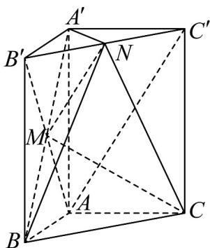

> [!faq]- 《专题21 立体几何初步及复数精选压轴60题12类考点专练（高效培优期中专项训练）数学人教A版高一必修第二册_57404446》官方解析
>
> > [!success]- **【答案】** (1)证明见解析 (2)证明见解析 (3) $\frac{4}{3}$
>
> > [!note]- **【分析】**
> > （1）连接 $AB'$ ， $AC'$ ，证明 $MN//AC'$ ，结合线面平行的判定定理即可求证；
> >
> > (2) 首先证明 $BB' \perp$ 面 $A'B'C'$ ，可得 $A'N \perp B'C'$ ， $A'N \perp B'B$ ，结合线面垂直的判定定理即可求证；
> >
> > (3) 利用由 (2) 可知 $A^{\prime}N \perp$ 平面 $BCN$ ，可得点 $A^{\prime}$ 到平面 $BCN$ 的距离为 $\sqrt{2}$ ，根据点 $M$ 为 $A^{\prime}B$ 的中点，
> >
> > 从而得到点 M 到平面 BCN 的距离，利用 $V_{C-MNB} = V_{M-BCN}$ 即可求解.
>
> > [!note]- **【解析】**
> > （1）如图，
> >
> > 
> >
> > 连接 $AB'$ ， $AC'$ ，
> >
> > ∵ 四边形 $ABB'A'$ 为矩形，M 为 $A'B$ 的中点，
> >
> > $\therefore AB'$ 与 $A'B$ 交于点 M，且 M 为 $AB'$ 的中点，
> >
> > 又点 N 为 $B^{\prime}C^{\prime}$ 的中点，∴ $MN // AC^{\prime}$
> >
> > 又 $MN \notin$ 平面 $A'ACC'$ ，且 $AC' \subset$ 平面 $A'ACC'$
> >
> > $$
> > \therefore M N / / _ {\text {平面}} A ^ {\prime} A C C ^ {\prime}.
> > $$
> >
> > (2) 直三棱柱 $ABC - A'B'C'$ 满足 $\angle BAC = 90^{\circ} = \angle B'A'C'$ ， $AB = AC = A'B' = A'C'$
> >
> > 又点 N 为 $B^{\prime}C^{\prime}$ 的中点，且 $BB^{\prime} \perp$ 面 $A^{\prime}B^{\prime}C^{\prime}$ ， $A^{\prime}N \subset$ 面 $A^{\prime}B^{\prime}C^{\prime}$ ，
> >
> > 所以 $A^{\prime}N \perp B^{\prime}C^{\prime}$ ， $A^{\prime}N \perp B^{\prime}B$ ，
> >
> > 又 $B^{\prime}C^{\prime}\cap BB^{\prime}=B^{\prime}$ ， $B^{\prime}C^{\prime}$ ， $BB^{\prime}\subset$ 面 BCN，
> >
> > $\therefore A^{\prime}N \perp$ 平面 BCN
> >
> > (3) 由图可知 $V_{C-MNB} = V_{M-BCN}$
> >
> > $\because \angle BAC = 90^{\circ}, AB = AC = \frac{1}{2} AA' = 2, \therefore BC = \sqrt{AB^{2} + AC^{2}} = 2\sqrt{2}$
> >
> > 又三棱柱 $ABC - A'B'C'$ 为直三棱柱，且 $AA' = 4$ ，
> >
> > $$
> > \therefore S _ {\triangle B C N} = \frac {1}{2} \times 2 \sqrt {2} \times 4 = 4 \sqrt {2}.
> > $$
> >
> > ∵ $A^{\prime}B^{\prime}=A^{\prime}C^{\prime}=2$ ， $\angle B^{\prime}A^{\prime}C^{\prime}=90^{\circ}$ ，N，点为 $B^{\prime}C^{\prime}$ 的中点，
> >
> > 所以 $A'N = \sqrt{2}$ .
> >
> > 由（2）可知 $A^{\prime}N \perp$ 平面 $BCN$ .
> >
> > 所以点 $A'$ 到平面 BCN 的距离为 $\sqrt{2}$ ，
> >
> > 又点 $M$ 为 $A'B$ 的中点，
> >
> > 所以点 $M$ 到平面 $BCN$ 的距离为 $\frac{\sqrt{2}}{2}$
> >
> > $$
> > \therefore V _ {C - M N B} = V _ {M - B C N} = \frac {1}{3} \times 4 \sqrt {2} \times \frac {\sqrt {2}}{2} = \frac {4}{3}.
> > $$
