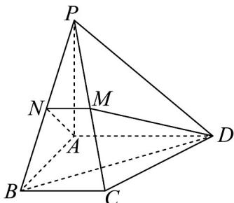

<!-- question-source:start -->
53. 如图，在四棱锥 $P - ABCD$ 中， $PA \perp$ 平面 $ABCD$ ，底面四边形 $ABCD$ 为直角梯形， $AD // BC$

$AD \perp AB$ ， $PA = AD = AB = 2$ ， $BC = 1$ ， $M, N$ 分别为 $PC$ ， $PB$ 中点.

(1)求证： $PB\perp DM$

(2)求 $BD$ 与平面ANMD所成角的余弦值.

(3)求点 $C$ 到平面 $PBD$ 的距离.

$$
\sqrt {3} \sqrt {3}
$$
<!-- question-source:end -->

![[高中/课堂同步/题库/人教A版高中数学同步讲义(2026)/02_必修第二册/期中专项训练+期中模拟卷/专题21 立体几何初步及复数精选压轴60题12类考点专练（高效培优期中专项训练）数学人教A版高一必修第二册_57404446/题型十一_空间直线与平面所成角及距离问题/questions/answers/Q00077503A1.md]]
