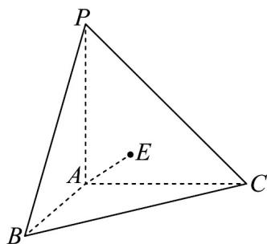

<!-- question-source:start -->
55. 如图，平面 $PAB \perp$ 平面 $ABC$ ，平面 $PAC \perp$ 平面 $ABC$ 。

(1)求证： $PA \perp$ 平面 ABC；

(2)点 $E$ 在侧面 $PBC$ （含边界）上运动，若平面 $PAC \perp$ 平面 $PAB$ ， $AP = AB = AC = \sqrt{2}AE = 1$ ，求 $E$ 的轨

迹长度.
<!-- question-source:end -->

![[高中/课堂同步/题库/人教A版高中数学同步讲义(2026)/02_必修第二册/期中专项训练+期中模拟卷/专题21 立体几何初步及复数精选压轴60题12类考点专练（高效培优期中专项训练）数学人教A版高一必修第二册_57404446/题型十一_空间直线与平面所成角及距离问题/questions/answers/Q00077505A1.md]]
