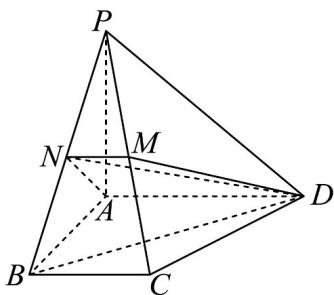

> [!faq]- 《专题21 立体几何初步及复数精选压轴60题12类考点专练（高效培优期中专项训练）数学人教A版高一必修第二册_57404446》官方解析
>
> > [!success]- **【答案】** (1)证明见解析(2) 2 (3) 3
>
> > [!note]- **【分析】**
> > （1）由 $AD \perp$ 平面 PAB，证明 $AD \perp PB$ ，结合等腰三角形 PAB 中 $AN \perp PB$ ，即可证明 $PB \perp$ 平
> >
> > 面 ANMD，由线面垂直性质得 $PB \perp DM$ ；
> >
> > (2) 关键在于找到 BD 与平面 ANMD 所成的角，由 (1) 知 $PB \perp$ 平面 ANMD，且 $PB \cap BD = B$ ，所以
> >
> > 为 $BD$ 与平面 $ANMD$ 所成角，进而结合边长可求其余弦值；
> >
> > (3) $C$ 到平面 $PBD$ 的距离就是三棱锥 $C - PBD$ 的高，使用等体积法将 $C - PBD$ 转化到 $P - BCD$ ，即可求
> >
> > 解.
>
> > [!note]- **【解析】**
> > （1）因为 $PA \perp$ 平面ABCD， $AD \subset$ 平面ABCD，所以 $PA \perp AD$ ，
> >
> > 又因为 $AD \perp AB$ ， $AB \cap PA = A$ ，且两直线在平面内，所以 $AD \perp$ 平面 PAB，
> >
> > 因为 $PB \subset$ 平面 PAB，所以 $AD \perp PB$ ，
> >
> > 因为 PA = AB = 2 ，且 N 为 PB 中点，所以 $AN \perp PB$ ，
> >
> > 又因为 $AN \cap AD = A$ ，所以 $PB \perp$ 平面 ANMD，
> >
> > 又因为 $DM \subset$ 平面 ANMD，所以 $PB \perp DM$
> >
> > (2) 连接 DN，因为 $PB \perp$ 平面 ANMD， $PB \cap BD = B$ ，所以 $\angle BDN$ 为 BD 与平面 ANMD 所成角，
> >
> > 又因为 $PA = AB = 2$ 且 $PA \perp AB$ ， $N$ 为 $PB$ 中点，所以 $AN = \sqrt{2}$
> >
> > 所以 $ND^{2} = AN^{2} + AD^{2} = 2 + 4 = 6$ ，即 $ND = \sqrt{6}$
> >
> > 又因为 $AD = AB = 2$ 且 $AB \perp AD$ ，所以 $BD = 2\sqrt{2}$
> >
> > 所以 $\cos\angle BDN=\frac{ND}{BD}=\frac{\sqrt{6}}{2\sqrt{2}}=\frac{\sqrt{3}}{2}$
> >
> > 所以 $BD$ 与平面 $ANMD$ 所成角的余弦值为 2 .
> >
> > 
> >
> > $$
> > \sqrt {3}
> > $$
> >
> > (3) 由已知得， $BD = \sqrt{AB^{2} + AD^{2}} = 2\sqrt{2}$ ， $PB = \sqrt{AB^{2} + AP^{2}} = 2\sqrt{2}$
> >
> > $$
> > P D = \sqrt {A P ^ {2} + A D ^ {2}} = 2 \sqrt {2}
> > $$
> >
> > $$
> > V _ {P - B C D} = \frac {1}{3} S _ {\triangle B C D} \times P A = \frac {1}{3} \times \frac {1}{2} \times 2 \times 1 \times 2 = \frac {2}{3},
> > $$
> >
> > 设点 C 到平面 PBD 的距离 h，
> >
> > $$
> > V _ {C - P B D} = \frac {1}{3} S _ {\triangle P B D} \times h = \frac {1}{3} \times \frac {1}{2} \times 2 \sqrt {2} \times 2 \sqrt {2} \times \frac {\sqrt {3}}{2} \times h = \frac {2 \sqrt {3}}{3} h
> > $$
> >
> > 由 $V_{P - BCD} = V_{C - PBD}$ ，即 $\frac{2}{3} = \frac{2\sqrt{3}}{3} h$ ，解得 $h = \frac{\sqrt{3}}{3}$ ，即点 $C$ 到平面 $PBD$ 的距离为 $\frac{\sqrt{3}}{3}$
