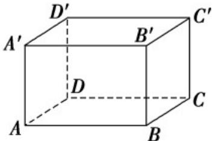

<!-- question-source:start -->
57．如图所示，在长方体 $A^{\prime}B^{\prime}C^{\prime}D^{\prime}-ABCD$ 中，AB=3cm，BC=2cm， $BB^{\prime}=1cm$ ，求：

(1)点 $A'$ 到平面 $B'BCC'$ 的距离；

(2)直线 $A^{\prime}D^{\prime}$ 与平面 ABCD 的距离；

(3)平面 $ABB'A'$ 与平面 $CDD'C'$ 的距离.
<!-- question-source:end -->

![[高中/课堂同步/题库/人教A版高中数学同步讲义(2026)/02_必修第二册/期中专项训练+期中模拟卷/专题21 立体几何初步及复数精选压轴60题12类考点专练（高效培优期中专项训练）数学人教A版高一必修第二册_57404446/题型十二_立体几何的综合性问题/questions/answers/Q00077507A1.md]]
