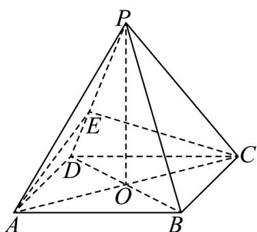

<!-- question-source:start -->
59. 如图，正四棱锥 $P - ABCD$ 中， $AC \cap BD = O$ ， $PO = AD = 6$ 。点 $E$ 在 $PD$ 上， $PE:ED = 2:1$

(1)证明： $PD \perp$ 平面 EAC；

(2)求二面角 A-PD-C 的余弦值；
<!-- question-source:end -->

![[高中/课堂同步/题库/人教A版高中数学同步讲义(2026)/02_必修第二册/期中专项训练+期中模拟卷/专题21 立体几何初步及复数精选压轴60题12类考点专练（高效培优期中专项训练）数学人教A版高一必修第二册_57404446/题型十二_立体几何的综合性问题/questions/answers/Q00077509A1.md]]
