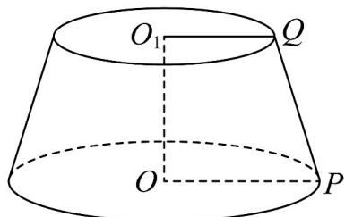

<!-- question-source:start -->
1．如图，圆台 $O_{1}O$ 的高为 $\sqrt{15}$ ，QP是母线， $O_{1}Q=3$ ，OP=QP.现在将圆台的侧面沿QP剪开，并展开

成平面图形，点 $P$ 在侧面展开图中对应的点为 $P_{1}$ ， $P_{2}$ ，则线段 $P_{1}P_{2}$ 的长度为（）

The Ground Truth image displays a single, solid horizontal line, which is a stylistic or background element (like a rule line on paper). According to Rule 2, such lines must be ignored by the OCR result. The provided OCR content is "\_\_\_\_", which consists of underscores. Underscores are not equivalent to a solid line and are not permitted under the “Stylistic/Background Lines (Ignore)” rule. Outputting underscores for a stylistic line is incorrect because it misinterprets the line as a placeholder fill-in-the-blank area. Since the OCR output includes underscores for a non-placeholder line, this violates the “Stylistic/Background Lines (Ignore)” rule. Therefore, the OCR result is inconsistent with the Ground Truth.

A.8 B. $8\sqrt{2}$ C.16 D. $16\sqrt{2}$
<!-- question-source:end -->

![[高中/课堂同步/题库/人教A版高中数学同步讲义(2026)/02_必修第二册/期中专项训练+期中模拟卷/专题21 立体几何初步及复数精选压轴60题12类考点专练（高效培优期中专项训练）数学人教A版高一必修第二册_57404446/题型十二_立体几何的综合性问题/questions/answers/Q00077511A1.md]]
