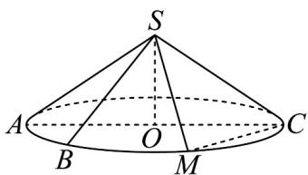

<!-- question-source:start -->
2．如图，AC 为圆锥 SO 的底面圆 O 的直径，AC = 4， $SO = \sqrt{2}$ ，M 为 AC 的中点，点 B 是圆 O 上的动

点（点 $M$ 、 $B$ 在直径 $AC$ 同侧），当 $\triangle SBC$ 的面积最大时，点 $B$ 到平面 $SMC$ 距离为（）

A. $\frac{3 - \sqrt{3}}{2}$ B. $\frac{\sqrt{3} - 1}{2}$ C. $\frac{\sqrt{3} + 1}{2}$ D. $\frac{\sqrt{6} - \sqrt{3}}{2}$
<!-- question-source:end -->

![[高中/课堂同步/题库/人教A版高中数学同步讲义(2026)/02_必修第二册/期中专项训练+期中模拟卷/专题21 立体几何初步及复数精选压轴60题12类考点专练（高效培优期中专项训练）数学人教A版高一必修第二册_57404446/题型十二_立体几何的综合性问题/questions/answers/Q00077512A1.md]]
