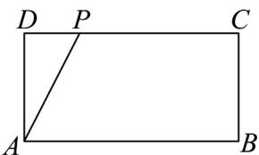
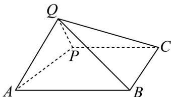

<!-- question-source:start -->
3．如图1，在长方形ABCD中，P是CD边上一点，且AB=4,AD=2,DP=1．将△ADP沿着AP翻折至
△ AQP , 连接 QB, QC ，得到如图2所示的四棱锥 Q-ABCP ，则下列结论正确的是（）

图1

图2

A. 四棱锥 $Q - ABCP$ 体积的最大值为 $\frac{14\sqrt{5}}{15}$ B. 当平面 $QAP \perp$ 平面 $ABCP$ 时，三棱锥 $Q - BCP$ 的外接球的表面积为 $\frac{69\pi}{5}$ C. 在翻折的过程中， $BP$ 与 $AQ$ 始终不垂直
D. 若 $\frac{\square\square\square\square}{BE} = \frac{1}{4} \frac{\square\square\square\square}{BQ}$ ，则 $CE = \frac{\sqrt{13}}{2}$
<!-- question-source:end -->

![[高中/课堂同步/题库/人教A版高中数学同步讲义(2026)/02_必修第二册/期中专项训练+期中模拟卷/专题21 立体几何初步及复数精选压轴60题12类考点专练（高效培优期中专项训练）数学人教A版高一必修第二册_57404446/题型十二_立体几何的综合性问题/questions/answers/Q00077513A1.md]]
