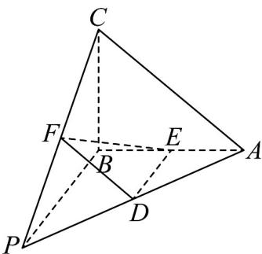

<!-- question-source:start -->
4．在三棱锥 P-ABC 中，PA=PB=PC=5，AC=6，BA⊥BC，D，E，F 分别是线段 PA，AB，

$$
P C
$$

的中点，则下列结论正确的是（）

A. $DE / /$ 平面 $PBC$ B.过 $D,E,F$ 的平面截三棱锥 $P - ABC$ 所得的截面的面积是定值
C. $PB\bot AC$ D.三棱锥 $P - ABC$ 外接球的表面积为 $\frac{625}{16}\pi$
<!-- question-source:end -->

![[高中/课堂同步/题库/人教A版高中数学同步讲义(2026)/02_必修第二册/期中专项训练+期中模拟卷/专题21 立体几何初步及复数精选压轴60题12类考点专练（高效培优期中专项训练）数学人教A版高一必修第二册_57404446/题型十二_立体几何的综合性问题/questions/answers/Q00077514A1.md]]
