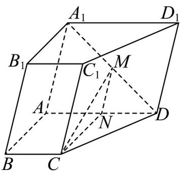

> [!faq]- 《专题21 立体几何初步及复数精选压轴60题12类考点专练（高效培优期中专项训练）数学人教A版高一必修第二册_57404446》官方解析
>
> > [!success]- **【答案】** 证明见解析
>
> > [!note]- **【分析】**
> > 要证明线面平行，可通过证明面面平行得到线面平行，即证明平面 $AA_{1}B_{1}B //$ 平面CMN
>
> > [!note]- **【解析】**
> > 如图，取 AD 的中点 N ，连接 MN ， CN .
> >
> > 
> >
> > 在 $\triangle ADA_{1}$ 中， $AN = ND$ ， $A_{1}M = MD$ ，所以 $MN // A_{1}A$
> >
> > 因为 $MN \not\subset$ 平面 $AA_{1}B_{1}B$ ， $AA_{1} \subset$ 平面 $AA_{1}B_{1}B$
> >
> > 所以 $MN / /$ 平面 $AA_{1}B_{1}B$
> >
> > 在直角梯形 ABCD 中，BC // AD，且 $BC = \frac{1}{2} AD = AN$
> >
> > 所以四边形 ABCN 是平行四边形，所以 $AB \parallel CN$
> >
> > 因为 $CN \not\subset$ 平面 $AA_{1}B_{1}B$ ， $AB \subset$ 平面 $AA_{1}B_{1}B$ ，
> >
> > 所以 $CN \parallel$ 平面 $AA_{1}B_{1}B$
> >
> > 因为 $CN \cap MN = N$ ，CN, MN ⊂ 平面 CMN，
> >
> > 所以平面 $AA_{1}B_{1}B \parallel$ 平面 CMN
> >
> > 又 $CM \subset$ 平面 $CMN$ ，所以 $CM //$ 平面 $AA_{1}B_{1}B$
