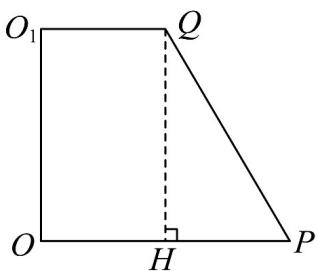
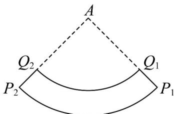

> [!faq]- 《专题21 立体几何初步及复数精选压轴60题12类考点专练（高效培优期中专项训练）数学人教A版高一必修第二册_57404446》官方解析
>
> > [!success]- **【答案】** D
>
> > [!note]- **【解析】**
> > 如图1，在圆台的轴截面中作 $QH \perp OP$ 于点H.
> >
> > 
> > 图1
> >
> > 设 HP = x ，由题意得 OP = QP = 3 + x ， QH = $\sqrt{15}$
> >
> > 由勾股定理可得 $15 = (3 + x)^2 - x^2$ ，解得 $x = 1$ ，所以 $OP = QP = 4$
> >
> > 侧面展开图如图2， $Q_{1}Q_{2}$ 的长为 $6\pi$ ， $P_{1}P_{2}$ 的长为 $8\pi$
> >
> > 
> > 图2
> >
> > 所以 $\frac{AQ_1}{AP_1} = \frac{6\pi}{8\pi} = \frac{3}{4}$ ，又 $P_{1}Q_{1} = 4$ ，所以 $AP_{1} = 16$
> >
> > 所以 $\angle P_{1}AP_{2}=\frac{8\pi}{16}=\frac{\pi}{2}$ ，所以 $P_{1}P_{2}=\sqrt{2}AP_{1}=16\sqrt{2}$
