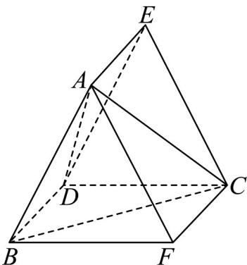

> [!faq]- 《专题21 立体几何初步及复数精选压轴60题12类考点专练（高效培优期中专项训练）数学人教A版高一必修第二册_57404446》官方解析
>
> > [!success]- **【答案】** $\sqrt{7}$
>
> > [!note]- **【分析】**
> > 作出辅助线，转化为三棱柱的外接球问题，结合正弦定理和余弦定理得到答案
>
> > [!note]- **【解析】**
> > 如图，过 B 作 $BF \parallel CD$ ，且 BF = CD，过 D 作 $DE \parallel AB$ ，且 DE = AB
> >
> > 
> >
> > 连接 AE ， AF ， CF ， CE ，根据题意可知 BD // AE // FC ， BD = AE = FC ，
> >
> > 由题意知 $BD \perp AB$ ， $BD \perp CD$ ， $BF // CD$ ，所以 $BD \perp BF$
> >
> > 又 AB，BF 是平面 ABF 内的两条相交直线，所以 $BD \perp$ 平面 ABF
> >
> > 所以三棱柱 $ABF - EDC$ 为直三棱柱.
> >
> > 则三棱锥 A-BCD 与直三棱柱 ABF-EDC 的外接球相同，设其半径为 R .
> >
> > 由 $S = 4\pi R^2 = 7\pi$ ，知 $R = \frac{\sqrt{7}}{2}$ ，设三角形ABF的外接圆半径为 $r$ ，
> >
> > 则 $R^2 = r^2 +\left(\frac{CF}{2}\right)^2$ ，求得 $r = \frac{\sqrt{6}}{2}$
> >
> > 设 $AC = x$ ，则 $AF = \sqrt{x^2 - 1}$ ，在 $\triangle ABF$ 中，设 $\angle ABF = \theta$ ， $AB = BF = \sqrt{3}$
> >
> > 则 $\cos\theta=\frac{AB^{2}+BF^{2}-AF^{2}}{2\cdot AB\cdot BF}=\frac{7-x^{2}}{6}$ ， $\sin\theta=\frac{AF}{2r}=\frac{\sqrt{x^{2}-1}}{\sqrt{6}}$
> >
> > 代入 $\sin^2\theta +\cos^2\theta = 1$ ，解得 $x^{2} = 7$ 或 $x^{2} = 1$ （舍），∴ $x = \sqrt{7}$
