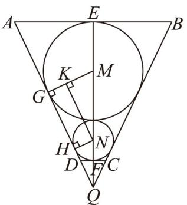

> [!faq]- 《专题21 立体几何初步及复数精选压轴60题12类考点专练（高效培优期中专项训练）数学人教A版高一必修第二册_57404446》官方解析
>
> > [!success]- **【答案】** $72\pi$
>
> > [!note]- **【分析】**
> > 通过轴截面结合相切的几何性质分析解决圆台的上下底面半径及高，求得圆台的体积，即可得
> >
> > 水的体积.
>
> > [!note]- **【解析】**
> > 作几何体的轴截面图如图，M,N 分别是大球和小球的球心，
> >
> > $Q$ 是圆台的轴截面等腰梯形 $ABCD$ 两腰 $AD$ 和 $BC$ 的延长线的交点.
> >
> > 
> >
> > 分别是球和球与圆台侧面的切点，分别是与圆台上下底面的切点．
> > G,H M N E,F
> >
> > 则 $GM \perp AQ, NH \perp AQ, QE \perp AB, QF \perp CD$ ，且 $GM = EM = 4$ ， $NH = NF = 2$ ， $EF = 8 + 4 = 12$ 。
> >
> > 过 N 点作 $NK \parallel AQ$ 交 GM 于 K，显然 $NK \perp GM$ ，可知四边形 NHGK 为矩形，
> >
> > 且 $MN = 6, MK = MG - KG = MG - NH = 2$
> >
> > 在直角三角形 $MNK$ 中， $\sin \angle MNK = \frac{MK}{MN} = \frac{1}{3}$
> >
> > 且 $\angle MNK$ 为锐角，则 $\cos \angle MNK = \sqrt{1 - \sin^2\angle MNK} = \frac{2\sqrt{2}}{3},\tan \angle MNK = \frac{\sqrt{2}}{4}$
> >
> > 由 $NK / / AQ$ 可得 $\angle MNK = \angle EQA$ ，所以 $\sin \angle EQA = \frac{1}{3},\tan \angle EQA = \frac{\sqrt{2}}{4}$
> >
> > 在直角三角形 $NHQ$ 中， $NH = 2$ ，得 $NQ = \frac{NH}{\sin\angle EQA} = 6$ ，所以 $FQ = NQ - NF = 6 - 2 = 4$
> >
> > 在直角三角形 $DFQ$ 中， $DF = FQ \cdot \tan \angle EQA = \sqrt{2}$
> >
> > 在直角三角形 $EQA$ 中， $EQ = EF + FQ = 12 + 4 = 16, AE = EQ \cdot \tan \angle EQA = 4\sqrt{2}$
> >
> > 即圆台的上底面半径 $AE = 4\sqrt{2}$ ，下底面半径 $DF = \sqrt{2}$ ，高 EF = 12。
> >
> > 可得圆台的体积 $V = \frac{1}{3}\pi \cdot EF(AE^2 + AE \cdot DF + DF^2) = 168\pi$
> >
> > 所以水的体积为 $168\pi - \frac{4}{3}\pi \times 2^3 - \frac{4}{3}\pi \times 4^3 = 72\pi$
> >
> > 故答案为： $72\pi$ .
