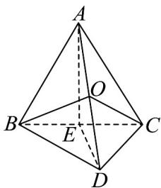

> [!faq]- 《专题21 立体几何初步及复数精选压轴60题12类考点专练（高效培优期中专项训练）数学人教A版高一必修第二册_57404446》官方解析
>
> > [!success]- **【答案】** $6\pi$
>
> > [!note]- **【分析】**
> > 取 $BC$ 的中点 $E$ ，由已知可得 $\angle AED$ 为二面角 $A - BC - D$ 的平面角，利用余弦定理求出 $AD = \sqrt{6}$
> >
> > 利用勾股定理的逆定理可得 $\triangle ABD, \triangle ACD$ 为直角三角形，则得 $AD$ 的中点 $O$ 为三棱锥 $A - BCD$ 的外接球的
> >
> > 球心，即可得到外接球的半径，进而求出表面积.
> >
> > 
>
> > [!note]- **【解析】**
> > 如图，取 BC 的中点 E，连接 AE、DE，
> >
> > 已知 $AB = AC = 2$ ， $\angle A = \frac{\pi}{3}$ ，所以 $AE\perp BC$ ， $BC = 2, AE = \sqrt{3}$
> >
> > 又 $BD = CD = \sqrt{2}$ ，所以 $DE\perp BC$ ， $DE = 1$
> >
> > 所以 $\angle AED$ 为二面角 $A - BC - D$ 的平面角，其余弦值为 $-\frac{\sqrt{3}}{3}$
> >
> > 在 $\triangle ADE$ 中，由余弦定理得
> >
> > $$
> > A D ^ {2} = A E ^ {2} + D E ^ {2} - 2 A E \cdot D E \cos \angle A E D = 3 + 1 - 2 \sqrt {3} \times \left(- \frac {\sqrt {3}}{3}\right) = 6
> > $$
> >
> > 即 $AD = \sqrt{6}$ ，则 $AB^{2} + BD^{2} = AD^{2},AC^{2} + CD^{2} = AD^{2}$
> >
> > 所以 $\triangle ADB, \triangle ADC$ 为直角三角形，
> >
> > 则 $AD$ 的中点 $O$ 为三棱锥 $A - BCD$ 的外接球的球心，
> >
> > 外接球的半径为 $\frac{1}{2}AD = \frac{\sqrt{6}}{2}$
> >
> > 所以三棱锥 $A - BCD$ 的外接球表面积为 $4\pi \left(\frac{\sqrt{6}}{2}\right)^2 = 6\pi$
