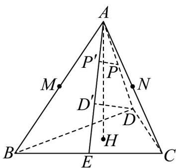
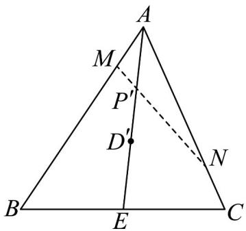

> [!faq]- 《专题21 立体几何初步及复数精选压轴60题12类考点专练（高效培优期中专项训练）数学人教A版高一必修第二册_57404446》官方解析
>
> > [!success]- **【答案】** (1)证明见解析(2) 3 $$ \frac {\sqrt {6}}{3} $$
>
> > [!note]- **【分析】**
> > （1）由正三棱锥 $A - BCD$ 的性质可知， $H$ 作为底面正 $\triangle BCD$ 的重心，同时是顶点 $A$ 在底面的投
> >
> > 影，因此 $AH \perp$ 平面 BCD ，进而 $AH \perp BC$ ；又正三角形的重心与垂心重合，故 $DH \perp BC$ 结合 AH 与
> >
> > $DH_{相交于}H$ ，根据线面垂直的判定定理，可得 $BC \perp$ 平面 AHD，最终由线面垂直的性质推出 $BC \perp AD$ 。
> >
> > (2) 本题先通过作投影确定正四面体中 $D^{\Phi}$ 为 $\mathrm{VABC}$ 的重心，利用正三角形性质算出相关线段长度，
> >
> > 再由相似三角形得到 $P$ 的投影 $P'$ 的位置与 $P$ 到平面 $ABC$ 的距离；接着用向量分解表示 $AP'$
> >
> > 结合三点共线的系数和为 1 建立参数方程，代入 $\mu = 1 - \lambda$ 求解 $\lambda$ ；最后根据垂线段最短，确定 $P$ 到
> >
> > MN 的最小距离为 P 到面 ABC 的距离 3
> >
> > $$
> > \frac {\sqrt {6}}{3}
> > $$
>
> > [!note]- **【解析】**
> > （1）因为三棱锥 A-BCD 为正三棱锥，所以 $\triangle BCD$ 为正三角形.
> >
> > 因为 H 是正 $\triangle BCD$ 的重心，也是 A 在平面 BCD 上的投影，故 $AH \perp$ 平面 BCD.
> >
> > $BC \subset$ 平面 BCD ，因此 $AH \perp BC$
> >
> > 又 H 为正 $\triangle BCD$ 重心，所以 H 也为正 $\triangle BCD$ 垂心，故 $DH \perp BC$ .
> >
> > 因为 $AH \cap DH = H$ ，且 $AH, DH \subset$ 平面 AHD，所以 $BC \perp$ 平面 AHD.
> >
> > 因为 $AD \subset$ 面 AHD ，所以 $AD \perp BC$ .
> >
> > (2) 如图所示，过 $P$ 作 $PP' \perp$ 平面 $ABC$ ，则 $P'$ 为 $P$ 在面 $ABC$ 的投影；过 $D$ 作 $DD' \perp$ 平面 $ABC$ ，则 $D^{\Phi}$ 为
> >
> > $D_{在平面}ABC$ 的投影.
> >
> > 
> >
> > 因为三棱锥每条棱长都为2，所以该三棱锥为正四面体，所以 $D^{\phi}$ 为VABC的重心.
> >
> > 因为正VABC边长为2，所以VABC高为 $|AE|=|AB|\sin60^{\circ}=\sqrt{3}$
> >
> > 延长 $AD'$ 交 BC 于 E ，由正三角形垂心重心重合得 $AE \perp BC$
> >
> > 所以重心 $D \notin$ 到VABC顶点距离 $\left|AD'\right| = \left|CD'\right| = \left|BD'\right| = \frac{2}{3} \times \sqrt{3} = \frac{2\sqrt{3}}{3}$ .
> >
> > 三棱锥 $D - ABC$ 的高 $\left|DD^{\prime}\right| = \sqrt{\left|AD\right|^2 - \left|AD^{\prime}\right|^2} = \sqrt{4 - \frac{4}{3}} = \frac{2\sqrt{6}}{3}$
> >
> > 因为 $PP' \perp$ 平面 ABC ， $DD' \perp$ 平面 ABC ，所以 $PP' \parallel DD'$
> >
> > 所以易得 $\triangle AP'P \sim \triangle AD'D$ .
> >
> > 因为 P 为 AD 中点，所以 $\left|PP'\right|=\frac{1}{2}\left|DD'\right|=\frac{1}{2}\times\frac{2\sqrt{6}}{3}=\frac{\sqrt{6}}{3}$
> >
> > 所以若存在 $\lambda$ 和 $\mu$ 使得线段 MN 经过 $P'$ ，则求 P 到 MN 距离的最小值即求 P 到平面 ABC 的距离 $\left|PP'\right|$ .
> >
> > 如图所示，假设存在 $\lambda$ 和 $\mu$ 使得线段 MN 经过 $P'$ ，则由题可知 $AM = \lambda AB; AN = \mu AC$ .
> >
> > 
> >
> > 因为 $D \notin$ 为 VABC 的重心， $P'$ 为 $AD'$ 中点，所以 $\left|AP'\right| = \frac{1}{2}\left|AD'\right| = \frac{1}{2} \times \frac{2}{3} \times \left|AE\right| = \frac{1}{3}\left|AE\right|$ .
> >
> > 即 $\frac{AP'}{3}=\frac{1}{3}\frac{AE}{AE}=\frac{1}{2}(AB+AC)$
> >
> > 所以 $\frac{\square\square\square}{AP'}=\frac{1}{6}\left(\frac{\square\square\square}{AB}+\frac{\square\square\square}{AC}\right)=\frac{1}{6}\left(\frac{1}{\lambda}\frac{\square\square\square\square}{AM}+\frac{1}{\mu}\frac{\square\square\square}{AN}\right)=\frac{1}{6\lambda}\frac{\square\square\square\square}{AM}+\frac{1}{6\mu}\frac{\square\square\square}{AN}$
> >
> > 由三点共线可知若 $\frac{1}{6\lambda} + \frac{1}{6\mu} = 1$ ，即 $\frac{\lambda + \mu}{6\lambda\mu} = 1$ 时，线段 MN 经过 $P'$
> >
> > 此时 $\lambda + \mu = 6\lambda\mu$
> >
> > 代入 $\mu = 1 - \lambda$ ，得 $1 = 6\lambda (1 - \lambda)$ ，即 $6\lambda^2 - 6\lambda + 1 = 0$
> >
> > 由求根公式， $\lambda = \frac{6\pm\sqrt{36 - 24}}{12} = \frac{6\pm 2\sqrt{3}}{12} = \frac{3\pm\sqrt{3}}{6}$
> >
> > 显然有 $\lambda < 1$ ，所以假设成立，即 $P$ 到MN距离的最小值即 $P$ 到面ABC的距离 $\left|PP^{\prime}\right| = \frac{\sqrt{6}}{3}$
