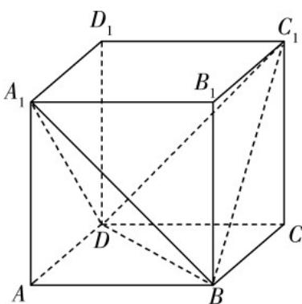

> [!faq]- 《专题21 立体几何初步及复数精选压轴60题12类考点专练（高效培优期中专项训练）数学人教A版高一必修第二册_57404446》官方解析
>
> > [!success]- **【答案】** A. $\left[2\sqrt{6}, 4\sqrt{2}\right]$ B. $\left[2\sqrt{3}, 4\sqrt{2}\right]$ C. $\left[2\sqrt{6}, 2\sqrt{7}\right]$ D. $\left[2\sqrt{3}, 2\sqrt{7}\right]$
>
> > [!note]- **【分析】**
> > 根据对称性得到 $C_1M = A_1M$ ，将问题转化为平面中点到直线的距离问题，垂线段最短，两边端
> >
> > 点处最长，即可求解.
>
> > [!note]- **【解析】**
> > 
> >
> > 依题意， $4\pi\cdot\left(\frac{\sqrt{3}AB}{2}\right)^{2}=12\pi$ ，解得AB=2，
> >
> > 根据对称性得， $C_{1}M = A_{1}M$
> >
> > 在 $\triangle A_{1}DB$ 中，因为 $A_{1}D = A_{1}B$ ，所以 $\triangle A_{1}DB$ 是等腰三角形，当 $M$ 为 $BD$ 的中点时， $A_{1}M$ 取得最小值 $\sqrt{6}$ ，
> > 当点 $M$ 与点 $B$ 或点 $D$ 重合时， $A_{1}M$ 取得最大值 $2\sqrt{2}$ ，
> > 所以 $C_{1}M + A_{1}M$ 的取值范围是 $[2\sqrt{6}, 4\sqrt{2}]$ .
