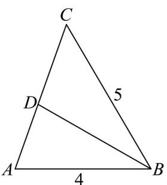

> [!faq]- 《专题22 解三角形精选压轴60题12类考点专练（高效培优期中专项训练）数学人教A版高一必修第二册_57404525》官方解析
>
> > [!success]- **【答案】** A
>
> > [!note]- **【分析】**
> > 先根据三角形角平分线的性质确定 AD 的长度，再利用余弦定理求 $\cos A$ 和 BD 的长.
>
> > [!note]- **【解析】**
> > 如图：
> >
> > 
> >
> > 因为 BD 平分 $\angle ABC$ ，所以 $\frac{AD}{CD} = \frac{AB}{BC} = \frac{4}{5}$ ，又 $AC = \sqrt{21}$ ，所以 $AD = \frac{4\sqrt{21}}{9}$ 。
> >
> > 在 $\forall ABC$ 中，根据余弦定理，可得 $\cos A = \frac{AB^2 + AC^2 - BC^2}{2\cdot AB\cdot AC} = \frac{16 + 21 - 25}{8\sqrt{21}} = \frac{3}{2\sqrt{21}}$
> >
> > 在 $\triangle ABD$ 中，根据余弦定理， $BD^{2} = AB^{2} + AD^{2} - 2\cdot AB\cdot AD\cdot \cos A = 16 + \frac{16\times 21}{81} -2\times 4\times \frac{4\sqrt{21}}{9}\times \frac{3}{2\sqrt{21}}$
> >
> > $$
> > = \frac {1 6 \times 2 5}{2 7}
> > $$
> >
> > 所以 $BD=\frac{4\times5}{3\sqrt{3}}=\frac{20\sqrt{3}}{9}$
