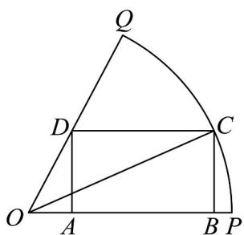

<!-- question-source:start -->
31．如图，在扇形 $OPQ$ 中，半径 $OP = 1$ ，圆心角 $\angle POQ = \frac{\pi}{3}$ ， $C$ 是弧 $PQ$ 上的动点，矩形 $ABCD$ 内接于扇

形，下列说法正确的是（）

A. 当 $\angle POC = \frac{\pi}{6}$ 时，矩形 $ABCD$ 为正方形
B. 当 $\angle POC = \alpha$ 时， $AB = \cos \alpha - \sqrt{3} \sin \alpha$ C. $\triangle OBC$ 面积的最大值为 $\frac{1}{4}$ D. 矩形 $ABCD$ 面积的最大值为 $\frac{\sqrt{2}}{6}$
<!-- question-source:end -->

![[高中/课堂同步/题库/人教A版高中数学同步讲义(2026)/02_必修第二册/期中专项训练+期中模拟卷/专题22 解三角形精选压轴60题12类考点专练（高效培优期中专项训练）数学人教A版高一必修第二册_57404525/题型七_几何图形中的计算/questions/answers/Q00077549A1.md]]
