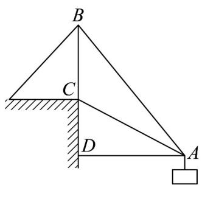

<!-- question-source:start -->
34．如图所示为起重机装置示意图，支杆 $BC = 10\mathrm{m}$ ，吊杆 $AC = 15\mathrm{m}$ ，吊索 $AB = 5\sqrt{19}\mathrm{m}$ ，起吊的货物与

岸的距离 AD 为 \_\_\_\_ m .

<!-- question-source:end -->

![[高中/课堂同步/题库/人教A版高中数学同步讲义(2026)/02_必修第二册/期中专项训练+期中模拟卷/专题22 解三角形精选压轴60题12类考点专练（高效培优期中专项训练）数学人教A版高一必修第二册_57404525/题型七_几何图形中的计算/questions/answers/Q00077552A1.md]]
