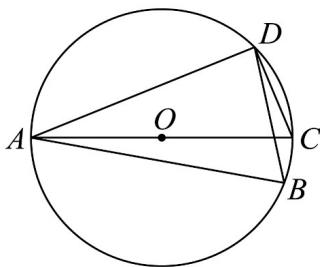

> [!faq]- 《专题22 解三角形精选压轴60题12类考点专练（高效培优期中专项训练）数学人教A版高一必修第二册_57404525》官方解析
>
> > [!success]- **【答案】** A. $AC = 2\sqrt{7}$ B. $\cos \angle CAD = \frac{\sqrt{7}}{7}$ C. 四边形 $ABCD$ 的周长为 $9 + 3\sqrt{3}$ D. 四边形 $ABCD$ 的面积为 $\frac{13\sqrt{3}}{2}$
>
> > [!note]- **【分析】**
> > 取 $AC$ 的中点为 $O$ ，由题意易知圆 $O$ 为四边形ABCD的外接圆，结合正余弦定理求相关线段长，
> >
> > 进而判断各项的正误.
>
> > [!note]- **【解析】**
> > 取 AC 的中点为 O，
> >
> > 由题意，圆 $O$ 为四边形ABCD的外接圆，记该外接圆的半径为 $R$ ，
> >
> > 在 $\triangle ABD$ 中， $BD^{2} = AB^{2} + AD^{2} - 2AB\cdot AD\cos \angle BAD = 21$ ，所以 $BD = \sqrt{21}$
> >
> > 由 $\frac{BD}{\sin\angle BAD} = 2R = AC = 2\sqrt{7}$
> >
> > 所以 $CD = \sqrt{AC^2 - AD^2} = 2\sqrt{3}$ ， $BC = \sqrt{AC^2 - AB^2} = \sqrt{3}$ ， $\cos \angle CAD = \frac{AD}{AC} = \frac{2\sqrt{7}}{7}$
> >
> > 四边形 ABCD 的周长为 $AB + BC + CD + AD = 9 + 3\sqrt{3}$
> >
> > 四边形ABCD的面积为 $\frac{1}{2} AB\cdot BC + \frac{1}{2} CD\cdot AD = \frac{1}{2}\times 5\times \sqrt{3} +\frac{1}{2}\times 2\sqrt{3}\times 4 = \frac{13\sqrt{3}}{2}$
> >
> > 
> >
> > 故选 **ACD**
