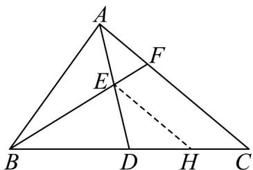

> [!faq]- 《专题22 解三角形精选压轴60题12类考点专练（高效培优期中专项训练）数学人教A版高一必修第二册_57404525》官方解析
>
> > [!success]- **【答案】** $\frac{\sqrt{6}}{2} / \frac{1}{2}\sqrt{6}$
>
> > [!note]- **【分析】**
> > 作 $EH / / FC$ 交 $BC$ 于点 $H$ ，利用几何知识可证得 $BE = 3EF$ ，再由余弦定理求得 $\cos \angle ABD = \frac{11}{16}$
> >
> > 再结合 $\overline{BE}=\frac{1}{2}\left(\overline{BA}+\overline{BD}\right)$ ，从而可求解.
>
> > [!note]- **【解析】**
> > 作 EH // FC 交 BC 于点 H ，
> >
> > 因为点 E 为 AD 中点，所以点 H 为 DC 中点，即 HD = HC
> >
> > 又因为 D 为 BC 中点，即 BD = DC ，
> >
> > 又因为 $HD = HC$ ，所以 $\frac{BH}{HC} = 3$ ，即 $BE = 3EF$ ，
> >
> > 在 $\triangle ABC$ ，由余弦定理可得 $\cos \angle ABD = \frac{AB^2 + BC^2 - AC^2}{2AB\times BC} = \frac{4^2 + 8^2 - 6^2}{2\times 4\times 8} = \frac{11}{16}$
> >
> > 在 $\triangle ABD$ 中， $BE = \frac{1}{2}\left(BA + BD\right)$
> >
> > 则 $\left|\begin{matrix}B E\\BA\end{matrix}\right|^{2}=\frac{1}{4}\left(\left|\begin{matrix}B A\\BA\end{matrix}\right|^{2}+\left|\begin{matrix}B D\\BD\end{matrix}\right|^{2}+2BA\cdot BD\right)=\frac{1}{4}\left(\left|\begin{matrix}B A\\BA\end{matrix}\right|^{2}+\left|\begin{matrix}B D\\BD\end{matrix}\right|^{2}+2\left|\begin{matrix}B A\\BA\end{matrix}\right|\cdot\left|\begin{matrix}B D\\BD\end{matrix}\right|\cos\angle ABD\right)$
> >
> > $$
> > = \frac {1}{4} \left(4 ^ {2} + 4 ^ {2} + 2 \times 4 \times 4 \times \frac {1 1}{1 6}\right) = \frac {2 7}{2}
> > $$
> >
> > 所以 $\left|\frac{\vec{B}E}{2}\right|=\frac{3\sqrt{6}}{2}$ ，则 $EF=\frac{BE}{3}=\frac{\sqrt{6}}{2}$
> >
> > 故答案为： $\frac{\sqrt{6}}{2}$
> >
> > 
