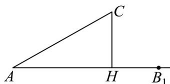

> [!faq]- 《专题22 解三角形精选压轴60题12类考点专练（高效培优期中专项训练）数学人教A版高一必修第二册_57404525》官方解析
>
> > [!success]- **【答案】** A．若 $a = 2\sqrt{3}$ ， $A = \frac{\pi}{3}$ ，则 $\forall ABC$ 的外接圆的面积为 $4\pi$ B．若 $A = 30^{\circ}$ ， $b = 5$ ， $a = 2$ ，则有两解 C．若 $a^{2} + b^{2} < c^{2}$ ，则 $\forall ABC$ 是锐角三角形 D．若 $a^{3} + b^{3} = c^{3}$ ，则 $\forall ABC$ 为锐角三角形
>
> > [!note]- **【分析】**
> > 对 A，根据条件，利用正弦定理，可得 R=2，即可求解；对 B，根据条件，数形结合，即可求解；对 C，根据条件，利用余弦定理得 $\cos C<0$ ，即可求解；对 D，利用 $a^{3}+b^{3}=c^{3}$ ，得到 a<c, b<c， $0 < \frac{a}{c} < 1, 0 < \frac{b}{c} < 1$ ，进而可得 $a^{2} + b^{2} > c^{2}$ ，再利用余弦定理，即可求解.
>
> > [!note]- **【解析】**
> > 对于选项 A，由正弦定理 $\frac{a}{\sin A} = \frac{b}{\sin B} = \frac{c}{\sin C} = 2R$ （其中 R 是 $\bigvee ABC$ 外接圆的半径），得到 $\frac{2\sqrt{3}}{\sin\frac{\pi}{3}} = 4 = 2R$ ，所以 $R = 2$ ，则 $\bigvee ABC$ 的外接圆的面积为 $\pi R^{2} = 4\pi$ ，所以 A 正确，
> >
> > 对于选项B，如图， $\angle CAB_{1} = \frac{\pi}{6}$ ， $AC = b = 5$ ，过 $C$ 作 $CH\perp AB_{1}$ 于 $H$
> >
> > 则 $CH = AC\sin \angle CAB_{1} = 5\sin \frac{\pi}{6} = \frac{5}{2} > 2 = a$ ，所以在射线 $AB_{1}$ 上不存在 $B$ ，
> >
> > 使 $A = 30^{\circ}$ ， $b = 5$ ， $a = 2$ ，即无解，所以B错误，
> >
> > 
> >
> > 对于选项 C，因为 $a^{2} + b^{2} < c^{2}$ ，由余弦定理得 $\cos C = \frac{a^{2} + b^{2} - c^{2}}{2ab} < 0$
> >
> > 又 $C \in (0, \pi)$ ，所以 $\frac{\pi}{2} < C < \pi$ ，故 $\vee_{ABC}$ 是钝角三角形，所以 $C$ 错误，
> >
> > 对于选项D，因为 $a^3 + b^3 = c^3$ ，则 $a < c, b < c$ ，且 $\left(\frac{a}{c}\right)^3 + \left(\frac{b}{c}\right)^3 = 1$
> >
> > 所以 $0 < \frac{a}{c} < 1, 0 < \frac{b}{c} < 1$ ，则 $\left(\frac{a}{c}\right)^3 < \left(\frac{a}{c}\right)^2, \left(\frac{b}{c}\right)^3 < \left(\frac{b}{c}\right)^2$
> >
> > 所以 $\left(\frac{a}{c}\right)^3 +\left(\frac{b}{c}\right)^3 <  \left(\frac{a}{c}\right)^2 +\left(\frac{b}{c}\right)^2$ ，得到 $1 <   \left(\frac{a}{c}\right)^{2} + \left(\frac{b}{c}\right)^{2}$ ，即 $a^2 +b^2 >c^2$
> >
> > 由余弦定理得 $\cos C = \frac{a^2 + b^2 - c^2}{2ab} > 0$ ，又 $C \in (0, \pi)$ ，所以 $0 < C < \frac{\pi}{2}$ ，故 $\forall ABC$ 是锐角三角形，所以 D 正确，
> >
> > 故选 **AD**.
