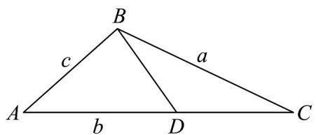

> [!faq]- 《专题22 解三角形精选压轴60题12类考点专练（高效培优期中专项训练）数学人教A版高一必修第二册_57404525》官方解析
>
> > [!success]- **【答案】** (1) $\frac{2\pi}{3}$ (2)证明见解析 (3) $\left(\frac{\sqrt{3}}{2},1\right]$
>
> > [!note]- **【分析】**
> > （1）利用三角形的面积公式和已知条件，结合正弦定理化简求得 $\tan B = -\sqrt{3}$ ，即可求得 $B$ 的值（2）先利用正弦定理求得 $CD = \frac{1}{\sin C}$ ， $AD = \frac{2}{\sin A}$ ，进而表示出 $b$ ，在结合正弦定理化简为角，化简运
> >
> > 算，即可得证；
> >
> > (3) 结合 (2)，利用三角恒等变换的公式，化简得到 $\frac{2}{AD} + \frac{1}{CD} = \sin \left( C + \frac{\pi}{3} \right)$ ，再结合 $C$ 的范围，利用正
> >
> > 弦函数的性质，即可求解.
>
> > [!note]- **【解析】**
> > （1）解：因为 $a^2 = -\frac{2\sqrt{3}}{3} S + ab\cos C$ ，可得 $a^2 = -\frac{2\sqrt{3}}{3}\times \frac{1}{2} ab\sin C + ab\cos C$
> >
> > 又因为 $a \neq 0$ ，所以 $a = -\frac{\sqrt{3}}{3} b \sin C + b \cos C$
> >
> > 由正弦定理得 $\sin A = -\frac{\sqrt{3}}{3}\sin B\sin C + \sin B\cos C$
> >
> > 又由 $\sin A = \sin(B + C) = \sin B \cos C + \cos B \sin C$
> >
> > 所以 $\sin B\cos C + \cos B\sin C = -\frac{\sqrt{3}}{3}\sin B\sin C + \sin B\cos C$
> >
> > 即 $\cos B\sin C = -\frac{\sqrt{3}}{3}\sin B\sin C$
> >
> > 因为 $C \in (0, \pi)$ ，可得 $\sin C > 0$ ，所以 $\cos B = -\frac{\sqrt{3}}{3} \sin B$ ，所以 $\tan B = -\sqrt{3}$
> >
> > 又因为 $B \in (0, \pi)$ ，所以 $B = \frac{2\pi}{3}$ .
> >
> > (2) 证明：因为 $AB \perp BD$ ，所以 $\angle DBC = \frac{2\pi}{3} - \frac{\pi}{2} = \frac{\pi}{6}$ ，
> >
> > 在 $\triangle BCD$ 中，由正弦定理得 $\frac{CD}{\sin\angle DBC} = \frac{BD}{\sin C}$ ，所以 $CD = \frac{BD\cdot\sin\angle DBC}{\sin C} = \frac{1}{\sin C}$
> >
> > 在直角 $\triangle ABD$ 中， $AD = \frac{BD}{\sin A} = \frac{2}{\sin A}$
> >
> > 所以 $b = |AC| = |AD| + |CD| = \frac{2}{\sin A} + \frac{1}{\sin C} = \frac{2\sin C + \sin A}{\sin A\sin C}$ ，所以 $\frac{1}{b} = \frac{\sin A\sin C}{2\sin C + \sin A}$
> >
> > 在 $\forall ABC$ 中，由正弦定理得 $\frac{a}{\sin A} = \frac{b}{\sin B} = \frac{c}{\sin C} = \frac{b}{\frac{\sqrt{3}}{2}} = \frac{2}{\sqrt{3}} b$
> >
> > 所以 $a = \frac{2}{\sqrt{3}} b\sin A, c = \frac{2}{\sqrt{3}} b\sin C$
> >
> > $$
> > \frac {4}{a} + \frac {2}{c} = \frac {4}{\frac {2}{\sqrt {3}} b \sin A} + \frac {2}{\frac {2}{\sqrt {3}} b \sin C} = \frac {\sqrt {3}}{2 b} \left(\frac {4}{\sin A} + \frac {2}{\sin C}\right) = \frac {\sqrt {3}}{2} \cdot \frac {\sin A \sin C}{2 \sin C + \sin A} \cdot \frac {4 \sin C + 2 \sin A}{\sin A \sin C} = \sqrt {3}
> > $$
> >
> > 
> >
> > (3) 解：由 (2) 知， $CD = \frac{1}{\sin C}, AD = \frac{2}{\sin A}$ ，所以 $\frac{2}{AD} + \frac{1}{CD} = \frac{2}{\frac{2}{\sin A}} + \frac{1}{\frac{1}{\sin C}} = \sin A + \sin C$
> >
> > 因为 $\angle ABC = \frac{2\pi}{3}$ ，所以 $A + C = \frac{\pi}{3}$ ，
> >
> > $$
> > \frac {2}{A D} + \frac {1}{C D} = \sin A + \sin C = \sin \left(\frac {\pi}{3} - C\right) + \sin C = \frac {\sqrt {3}}{2} \cos C - \frac {1}{2} \sin C + \sin C = \frac {\sqrt {3}}{2} \cos C + \frac {1}{2} \sin C = \sin \left(C + \frac {\pi}{3}\right)
> > $$
> >
> > 因为 $C \in (0, \frac{\pi}{3})$ ，所以 $C + \frac{\pi}{3} \in (\frac{\pi}{3}, \frac{2\pi}{3})$ ，所以 $\sin(C + \frac{\pi}{3}) \in (\frac{\sqrt{3}}{2}, 1]$
> >
> > 故 $\frac{2}{AD} + \frac{1}{CD}$ 的取值范围为 $(\frac{\sqrt{3}}{2}, 1]$ .
