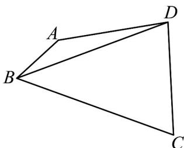

<!-- question-source:start -->
55. 如图，在平面四边形 $ABCD$ 中， $AB = 1$ ， $BC = 3$ ， $AD = CD = 2$ .

(1)当四边形 ABCD 内接于圆 O 时，求角 C；

(2)当四边形ABCD面积最大时，求对角线BD的长.
<!-- question-source:end -->

![[高中/课堂同步/题库/人教A版高中数学同步讲义(2026)/02_必修第二册/期中专项训练+期中模拟卷/专题22 解三角形精选压轴60题12类考点专练（高效培优期中专项训练）数学人教A版高一必修第二册_57404525/题型十一_正余弦定理与三角函数性质的综合应用/questions/answers/Q00077573A1.md]]
