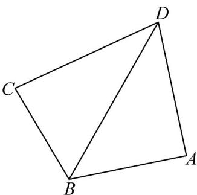

> [!faq]- 《专题22 解三角形精选压轴60题12类考点专练（高效培优期中专项训练）数学人教A版高一必修第二册_57404525》官方解析
>
> > [!success]- **【答案】** (1) $CD=\sqrt{13}$ (2) $2\sqrt{21}$
>
> > [!note]- **【分析】**
> > （1）由同角关系可得正弦值，进而由和差角公式，结合余弦定理即可求解，
> >
> > (2) 根据正弦定理可得 $CD = 2\sqrt{7}\sin \theta$ ，同理可知 $AD = 2\sqrt{7}\sin \left(\frac{2\pi}{3} - \theta\right) = 2\sqrt{7}\left(\frac{\sqrt{3}}{2}\cos \theta + \frac{1}{2}\sin \theta\right)$ ，进而
> >
> > 由三角函数的性质即可求解最值.
>
> > [!note]- **【解析】**
> > （1）因为 $\cos\angle ABD=\frac{1}{7}>0$ ，所以 $\sin\angle ABD=\sqrt{1-\cos^{2}\angle ABD}=\frac{4\sqrt{3}}{7}$ ，
> >
> > 所以 $\cos\angle CBD=\cos\left(\frac{2\pi}{3}-\angle ABD\right)=-\frac{1}{2}\cos\angle ABD+\frac{\sqrt{3}}{2}\sin\angle ABD=\frac{11}{14}$
> >
> > 由余弦定理可知， $CD^{2}=BD^{2}+BC^{2}-2BD\cdot BC\cdot\cos\angle CBD=7+28-2\times\sqrt{7}\times2\sqrt{7}\times\frac{11}{14}=13$ ，即 $CD=\sqrt{13}$
> >
> > (2) 因为四边形 ABCD 有外接圆，所以 $\angle ADC = \pi - \angle ABC = \frac{\pi}{3}$
> >
> > 因为 $AB = BC$ ，且由正弦定理可知， $\frac{AB}{\sin\angle ADB} = \frac{BC}{\sin\angle CDB} = 2R$
> >
> > 所以 $\sin\angle ADB = \sin\angle CDB$ ，即 $\angle ADB = \angle CDB = \frac{\pi}{6}$ ，
> >
> > 设 $\angle DBC = \theta \in \left(0, \frac{2\pi}{3}\right)$ ，则 $\angle ABD = \frac{2\pi}{3} - \theta$
> >
> > 由正弦定理可知， $\frac{CD}{\sin\theta} = \frac{BC}{\sin\angle CDB} = \frac{\sqrt{7}}{\frac{1}{2}} = 2\sqrt{7}$
> >
> > 所以 $CD = 2\sqrt{7}\sin \theta$ ，同理可知 $AD = 2\sqrt{7}\sin \left(\frac{2\pi}{3} -\theta\right) = 2\sqrt{7}\left(\frac{\sqrt{3}}{2}\cos \theta +\frac{1}{2}\sin \theta\right)$
> >
> > 所以 $CD + AD = 2\sqrt{7}\left(\frac{\sqrt{3}}{2}\cos \theta +\frac{3}{2}\sin \theta\right) = 2\sqrt{21}\sin \left(\theta +\frac{\pi}{6}\right)$
> >
> > 因为 $\theta \in \left(0, \frac{2\pi}{3}\right)$ ，所以 $\theta + \frac{\pi}{6} \in \left(\frac{\pi}{6}, \frac{5\pi}{6}\right)$ ，所以当 $\theta + \frac{\pi}{6} = \frac{\pi}{2}$
> >
> > 即 $\theta=\frac{\pi}{3}$ 时， $AD+CD$ 取得最大值为 $2\sqrt{21}$
> >
> > 
