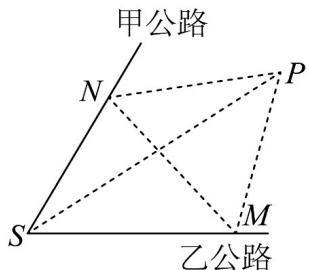

<!-- question-source:start -->
56. $A$ 市为进一步缓解交通压力，现经过甲公路和乙公路，分别修建新地铁线和快速通道，如图已知 $S$ 小

区在两条公路汇合处，两条公路夹角为 $60^{\circ}$ ，为了便于施工拟在两条公路之间的区域内建一混凝土搅拌站

P，并分别在两条公路边上建两个中转站 M、N（异于点 S），要求 PM = PN = MN = 4（单位：千米）.

设 $\angle SMN = \theta$

(1)用 $\theta$ 表示 $SN$ 并写出 $\theta$ 的范围；

(2)当搅拌站 P 与小区 S 的距离最远时，求 $\theta$ 的值.
<!-- question-source:end -->

![[高中/课堂同步/题库/人教A版高中数学同步讲义(2026)/02_必修第二册/期中专项训练+期中模拟卷/专题22 解三角形精选压轴60题12类考点专练（高效培优期中专项训练）数学人教A版高一必修第二册_57404525/题型十二_距离_高度_角度的测量问题/questions/answers/Q00077574A1.md]]
