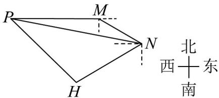

<!-- question-source:start -->
57. 如图，甲船在点 $M$ 处通过雷达发现在其南偏东 $60^{\circ}$ 方向相距20海里的 $N$ 处有一艘货船发出供油补给

需求，该货船正以15海里/时的速度从 $N$ 处向南偏西 $60^{\circ}$ 的方向行驶．甲船立即通知在其正西方向且相距

$30\sqrt{3}$ 海里的 $P$ 处的补给船，补给船立刻以25海里/时的速度与货船在 $H$ 处会合.

(1)求 $PN$ 的长；

(2)试问补给船至少应行驶几小时，才能与货船会合？
<!-- question-source:end -->

![[高中/课堂同步/题库/人教A版高中数学同步讲义(2026)/02_必修第二册/期中专项训练+期中模拟卷/专题22 解三角形精选压轴60题12类考点专练（高效培优期中专项训练）数学人教A版高一必修第二册_57404525/题型十二_距离_高度_角度的测量问题/questions/answers/Q00077575A1.md]]
