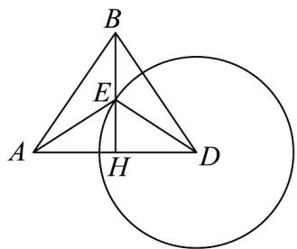

<!-- question-source:start -->
58. 如图，我海监船在 $D$ 岛海域例行维权巡航，某时刻航行至 $A$ 处，此时测得其北偏东 $30^{\circ}$ 方向与它相距

20 海里的 B 处有一外国船只，且 D 岛位于海监船正东 18 海里处.

(1)求此时该外国船只与 $D$ 岛的距离；

(2)观测中发现，此外国船只正以每小时4海里的速度沿正南方航行.为了将该船拦截在离D岛12海里的E

处（ $E$ 在 $B$ 的正南方向），不让其进入 $D$ 岛12海里内的海域，试确定海监船的航向，并求其速度的最小

值·（角度精确到 $0.1^{\circ}$ ，速度精确到 0.1 海里/小时）
<!-- question-source:end -->

![[高中/课堂同步/题库/人教A版高中数学同步讲义(2026)/02_必修第二册/期中专项训练+期中模拟卷/专题22 解三角形精选压轴60题12类考点专练（高效培优期中专项训练）数学人教A版高一必修第二册_57404525/题型十二_距离_高度_角度的测量问题/questions/answers/Q00077576A1.md]]
