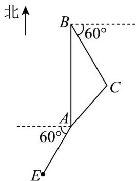

<!-- question-source:start -->
59. 已知甲船在 $A$ 海岛正北方向 $15\sqrt{3}$ 海里的 $B$ 处，以7海里/小时的速度沿东偏南 $60^{\circ}$ 的方向航行。

(1)甲船航行3小时到达C处，求AC；

(2)在 $A$ 海岛西偏南 $60^{\circ}$ 方向6海里的 $E$ 处，乙船因故障等待救援．当甲船到达 $A$ 海岛正东方向的 $D$ 处时，

接收到乙船的求援信号．已知距离 A 海岛 3 海里以外的海区为航行安全区域，甲船能否沿 DE 方向航行前

往救援？请说明理由。
<!-- question-source:end -->

![[高中/课堂同步/题库/人教A版高中数学同步讲义(2026)/02_必修第二册/期中专项训练+期中模拟卷/专题22 解三角形精选压轴60题12类考点专练（高效培优期中专项训练）数学人教A版高一必修第二册_57404525/题型十二_距离_高度_角度的测量问题/questions/answers/Q00077577A1.md]]
