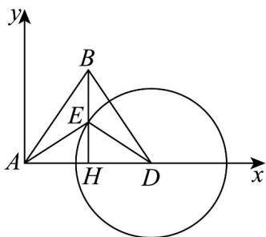

> [!faq]- 《专题22 解三角形精选压轴60题12类考点专练（高效培优期中专项训练）数学人教A版高一必修第二册_57404525》官方解析
>
> > [!success]- **【答案】** (1) $2\sqrt{91}$ 海里； (2)海监船的航向为北偏东 $48.2^{\circ}$ ，速度的最小值为 6.4 海里/小时.
>
> > [!note]- **【分析】**
> > （1）依题意，在 $\triangle ABD$ 中， $\angle DAB = 60^{\circ}$ ，由余弦定理求得DB；
> >
> > (2) 建立以点 $A$ 为坐标原点， $AD$ 为 $x$ 轴，过点 $A$ 往正北作垂直的 $y$ 轴。可得 $A, D, B$ 的坐标，设经过 $t$ 小时外国船到达点 $E\left(10,10\sqrt{3} - 4t\right)$ ，结合 $ED = 12$ ，得 $E\left(10,4\sqrt{5}\right)$ ，列等式求得 $t$ ，则 $\tan \angle EAD = \frac{EH}{AH} = \frac{2\sqrt{5}}{5}$ ， $\angle EAD = \arctan \frac{2\sqrt{5}}{5} \approx 41.81^\circ$ ，再由 $v = \frac{AE}{t}$ 求得速度的最小值。
>
> > [!note]- **【解析】**
> > （1）依题意，在 $\triangle ABD$ 中， $\angle DAB = 60^{\circ}$
> >
> > 由余弦定理得 $DB^{2} = AD^{2} + AB^{2} - 2AD\cdot AB\cdot \cos 60^{\circ}$
> >
> > $$
> > = 1 8 ^ {2} + 2 0 ^ {2} - 2 \times 1 8 \times 2 0 \times \cos 6 0 ^ {\circ} = 3 6 4
> > $$
> >
> > $\therefore DB=2\sqrt{91}$
> >
> > 即此时该外国船只与 D 岛的距离为 $2\sqrt{91}$ 海里.
> >
> > (2) 建立以点 A 为坐标原点，AD 为 x 轴，过点 A 往正北方向为 y 轴的坐标系，如图，
> >
> > 
> >
> > 则 $A(0,0)$ ， $D(18,0)$ ， $B(10,10\sqrt{3})$
> >
> > 设经过 t 小时外国船只到达点 $E\left(10,10\sqrt{3}-4t\right)$ .
> >
> > 又 $ED = 12$ ，所以 $EH = \sqrt{12^2 - (18 - 10)^2} = 4\sqrt{5}$
> >
> > 由 $ED = \sqrt{(18 - 10)^{2} + (4t - 10\sqrt{3})^{2}} = 12$ ，解得 $t = \frac{10\sqrt{3} - 4\sqrt{5}}{4}$ 或 $t = \frac{10\sqrt{3} + 4\sqrt{5}}{4}$ （舍去），
> >
> > 故 $t=\frac{10\sqrt{3}-4\sqrt{5}}{4}\approx2.09$ （小时），
> >
> > 则 $\tan\angle EAD=\frac{EH}{AH}=\frac{4\sqrt{5}}{10}=\frac{2\sqrt{5}}{5}$
> >
> > $$
> > \angle E A D = \arctan \frac {2 \sqrt {5}}{5} \approx 4 1. 8 ^ {\circ}
> > $$
> >
> > ∴海监船的航向为东偏北 $41.8^{\circ}$ ,
> >
> > $v \frac{AE}{t} = \frac{6\sqrt{5}}{\frac{10\sqrt{3} - 4\sqrt{5}}{4}} \approx 6.4$ ∴海监船的速度 （海里/小时）.
> >
> > 又 $90^{\circ} - 41.8^{\circ} = 48.2^{\circ}$
> >
> > 故海监船的航向为北偏东 $48.2^{\circ}$ ，速度的最小值为 6.4 海里/小时.
