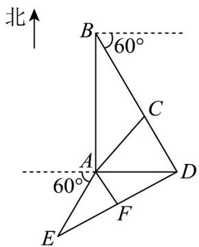

> [!faq]- 《专题22 解三角形精选压轴60题12类考点专练（高效培优期中专项训练）数学人教A版高一必修第二册_57404525》官方解析
>
> > [!success]- **【答案】** (1) $AC = \sqrt{171}$ 海里； (2)甲船能沿 DE 方向航行前往救援，理由见解析.
>
> > [!note]- **【分析】**
> > （1）在 $\vee ABC$ 中使用余弦定理即可求得答案.
> >
> > (2) 先根据题目所给的条件作图，在 $\triangle ABD$ 中，由 $AD = AB \tan \angle ABC$ 求得 $AD$ 长度，在 $\forall ADE$ 中，先
> >
> > 根据余弦定理求得 DE 长度，再利用等面积法求得 AF 长度，即可判断.
>
> > [!note]- **【解析】**
> > （1）由题意得， $AB=15\sqrt{3}$ 海里， $BC=3\times7=21$ 海里， $\angle ABC=90^{\circ}-60^{\circ}=30^{\circ}$
> >
> > 在 $\vee ABC$ 中，由余弦定理得 $AC^2 = AB^2 + BC^2 - 2 \cdot AB \cdot BC \cdot \cos \angle ABC$
> >
> > $$
> > = (1 5 \sqrt {3}) ^ {2} + 2 1 ^ {2} - 2 \times 1 5 \sqrt {3} \times 2 1 \times \cos 3 0 ^ {\circ} = 1 7 1
> > $$
> >
> > 所以， $AC=\sqrt{171}$ （海里）.
> >
> > (2) 甲船能沿 $DE$ 方向航行前往救援，理由如下：
> >
> > 如图所示，延长 BC，过点 A 向正东方向作 AD 交 BC 的延长线于点 D，连接 DE，过点 A 作 $AF \perp DE$ 交
> >
> > $DE_{于点F}$ ,
> >
> > 在 $\triangle ABD$ 中， $AD = AB \tan \angle ABC = 15\sqrt{3} \times \frac{\sqrt{3}}{3} = 15$ （海里），
> >
> > 在VADE中，AE=6（海里）， $\angle DAE=180^{\circ}-60^{\circ}=120^{\circ}$ ，由余弦定理得
> >
> > $$
> > D E ^ {2} = A D ^ {2} + A E ^ {2} - 2 \cdot A D \cdot A E \cdot \cos \angle D A E = 1 5 ^ {2} + 6 ^ {2} - 2 \times 1 5 \times 6 \times \cos 1 2 0 ^ {\circ} = 3 5 1
> > $$
> >
> > 所以 $DE = \sqrt{351}$ （海里），
> >
> > 所以 $AF = \frac{S_{\triangle ADE}}{\frac{1}{2} DE} = \frac{\frac{1}{2} \times 15 \times 6 \times \frac{\sqrt{3}}{2}}{\frac{1}{2} \times \sqrt{351}} = \frac{15\sqrt{13}}{13} > 3$
> >
> > 因此甲船能沿 DE 方向航行前往救援.
> >
> > 
