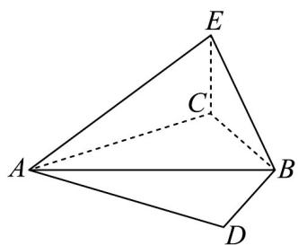

> [!faq]- 《专题22 解三角形精选压轴60题12类考点专练（高效培优期中专项训练）数学人教A版高一必修第二册_57404525》官方解析
>
> > [!success]- **【答案】** 在 C 处有一古塔，市政府为升级绿道沿途风景，计划在某段全长 200 米的直线绿道 AB 一侧规划一个三角形区域（古塔的底座忽略不计）ABC 做绿化，如图，已知 $\angle CAB = \frac{\pi}{3}$ ，为提升美观度，设计师拟将绿化区设计为一个锐角三角形.  (1)若在 A、B 处分别测得塔顶 E 的仰角为 $45^{\circ}$ 、 $30^{\circ}$ ，求塔高 CE； (2)求绿化区域VABC面积的取值范围； (3)绿化完成后，某游客在绿道 $AB$ 的另一侧空地上寻找最佳拍照打卡点，该游客从 $A$ 到 $D$ ，再从 $D$ 到 $B$ ： 已知 $\angle ADB = \frac{\pi}{3}$ ，求游客所走路程的最大值.
>
> > [!note]- **【分析】**
> > （1）设 $CE = x$ 米，根据解直角三角形可得 $AC = x$ ， $BC = \sqrt{3} x$ ，结合余弦定理可求塔高；
> >
> > (2) 设 $\angle ACB = \alpha$ ，由正弦定理结合面积公式可得 $AC = \frac{100\sqrt{3}}{\tan\alpha} + 100$ ，根据锐角三角形求出 $\alpha$ 的范围后
> >
> > 可得 AC 的范围后得面积的范围；
> >
> > (3) 根据余弦定理和基本不等式可求路程的最大值.
>
> > [!note]- **【解析】**
> > （1）设 CE = x 米，
> >
> > $\because$ 依题意可知 $CE \perp AC$ $CE \perp BC$
> >
> > 又在 A、B 处分别测得塔顶 E 的仰角为 $45^{\circ}$ 、 $30^{\circ}$ 即 $\angle EAC = 45^{\circ}$ ， $\angle EBC = 30^{\circ}$ ，
> >
> > $\therefore$ 可知 $AC = x$ , $BC = \sqrt{3}x$ , $\therefore$ 在 $\bigvee ABC$ 中, $\angle CAB = \frac{\pi}{3}$ ,
> >
> > 据余弦定理得 $BC^{2} = AC^{2} + AB^{2} - 2AC \cdot AB \cos \angle CAB$
> >
> > 即 $3x^{2} = x^{2} + 200^{2} - 200x$ ，解得： $x = 100$ 或 $x = -200$ （舍去）
> >
> > $\therefore$ 塔高 CE 为 100 米.
> >
> > (2) 设 $\angle ACB = \alpha$ ，则 $\angle CBA = \frac{2\pi}{3} - \alpha$ ，
> >
> > 则在 $\bigvee ABC$ 中，据正弦定理得 $\frac{AB}{\sin\alpha} = \frac{AC}{\sin\left(\frac{2\pi}{3} - \alpha\right)}$ ，故 $AC = \frac{100\sqrt{3}}{\tan\alpha} + 100$ ，
> >
> > 又依题可知，为锐角三角形，则 $\left\{ \begin{array}{l} 0 < \alpha < \frac{\pi}{2} \\ 0 < \frac{2\pi}{3} - \alpha < \frac{\pi}{2} \quad \text{即} \\ \frac{\pi}{6} < \alpha < \frac{\pi}{2} \end{array} \right.$
> >
> > 故 $\tan \alpha \in \left(\frac{\sqrt{3}}{3}, +\infty\right)$ ，则 $AC = \frac{100\sqrt{3}}{\tan\alpha} +100\in (100,400)$
> >
> > 又 $S_{\triangle ABC} = \frac{1}{2}\cdot AC\cdot AB\cdot \sin \angle CAB = 50\sqrt{3} AC$ ，则 $S_{\triangle ABC}\in \left(5000\sqrt{3},20000\sqrt{3}\right).$
> >
> > （3）在 $\triangle ABD$ 中，据余弦定理得 $AB^{2} = AD^{2} + DB^{2} - 2AD\cdot DB\cdot \cos D$
> >
> > $$
> > \therefore 2 0 0 ^ {2} = A D ^ {2} + D B ^ {2} - A D \cdot D B = (A D + D B) ^ {2} - 3 A D \cdot D B
> > $$
> >
> > $$
> > \left(A D + D B\right) ^ {2} - 3 \left(\frac {A D + D B}{2}\right) ^ {2} = \frac {1}{4} (A D + D B) ^ {2}
> > $$
> >
> > $$
> > \therefore (A D + D B) ^ {2} \leq 4 \times 2 0 0 ^ {2} \quad \therefore A D + D B \leq 4 0 0
> > $$
> >
> > 当且仅当 AD = BD = 200 时取等号，故所走路程 $AD + BD$ 的最大值为 400 米.
> >
> > ## 考题猜想·高分必刷
