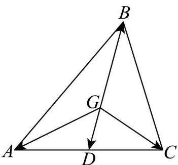
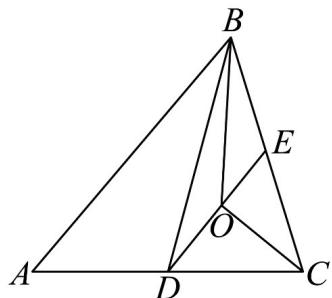

> [!faq]- 《专题22 解三角形精选压轴60题12类考点专练（高效培优期中专项训练）数学人教A版高一必修第二册_57404525》官方解析
>
> > [!success]- **【答案】** A．若 $a = 8, b = 10, B = 60^{\circ}$ ，则符合条件的 $\forall ABC$ 有两个 B．若点 G 为 VABC 的重心，则 $\stackrel{\square\square}{GA} + \stackrel{\square\square\square}{GB} + \stackrel{\square\square\square}{GC} = 0$ C．若点 $\underset{P}{\text{为}}$ $\forall ABC$ 所在平面内的动点，且 $\overrightarrow{AP} = \lambda \left( \frac{\overrightarrow{AB}}{|AB| \cos B} + \frac{\overrightarrow{AC}}{|AC| \cos C} \right)$ ， $\lambda \in (0, +\infty)$ ，则点 $P$ 的轨 迹经过VABC的垂心 D．已知O是VABC内一点，若 $2\overline{OA}+\overline{OB}+3\overline{OC}=0$ ， $S_{\triangle AOC}$ ， $S_{\triangle ABC}$ 分别表示 $\triangle AOC$ ， $\triangle ABC$ 的面积， 则 $S_{\triangle AOC}: S_{\triangle ABC} = 16$
>
> > [!note]- **【分析】**
> > 对于 A，根据正弦定理求得 $\sin A = \frac{2\sqrt{3}}{5}$ ，再结合 a < b 即可判定；对于 B，根据重心为中线交点
> >
> > 判断即可；对于 C，根据 $\overline{AP} \cdot \overline{BC} = 0$ 判断；对于 D，设 AC，BC 的中点分别为 E, D，进而得 $\overline{OE} = \frac{1}{3} \overline{DE}$
> >
> > 再结合面积公式判断.
>
> > [!note]- **【解析】**
> > 对于A，由正弦定理可知 $\frac{a}{\sin A} = \frac{b}{\sin B}$ ，即 $\frac{8}{\sin A} = \frac{10}{\sin 60^{\circ}}$ ，解得 $\sin A = \frac{2\sqrt{3}}{5}$
> >
> > 又 $a < b$ ，所以 $A < B = 60^{\circ}$ ，故A只有一解，所以三角形一解，故A错误；
> >
> > 对于B，因为点 $G$ 为 $\vee ABC$ 的重心，设 $AC$ 中点为 $D$ ，则 $\overline{GB} = -2\overline{GD}$
> >
> > $\overline{GA} + \overline{GB} + \overline{GC} = \left( \overline{GA} + \overline{GC} \right) + \overline{GB} = 2\overline{GD} + \overline{GB} = 0$ ，故 B 正确；
> >
> > 
> >
> > 对于 C，因为 $\overrightarrow{AP} = \lambda \left( \frac{\overrightarrow{AB}}{|AB| \cos B} + \frac{\overrightarrow{AC}}{|AC| \cos C} \right)$
> >
> > 所以 $\overrightarrow{AP} \cdot \overrightarrow{BC} = \lambda \left( \frac{\overrightarrow{AB} \cdot \overrightarrow{BC}}{|AB| \cos B} + \frac{\overrightarrow{AC} \cdot \overrightarrow{BC}}{|AC| \cos C} \right) = \lambda \left( \frac{\left|AB\right|\left|BC\right|\cos(\pi - B)}{|AB| \cos B} + \frac{\left|AC\right| \cdot \left|BC\right|\cos C}{|AC| \cos C} \right) = \lambda \left( -\left|BC\right| + \left|BC\right| \right) = 0$
> >
> > 所以 $AP \perp BC$ ，所以点 P 的轨迹经过 $\forall ABC$ 的垂心，故 C 正确；
> >
> > 对于 D，因为 $2\overline{OA} + \overline{OB} + 3\overline{OC} = 0$ ，所以 $2\left(\overline{OA} + \overline{OC}\right) + \left(\overline{OB} + \overline{OC}\right) = 0$
> >
> > 设 $AC, BC$ 的中点分别为 $E, D$ ，如图，则 $\frac{2OE + OD}{0}$ 即 $\frac{OE}{3} = \frac{1}{3} DE$
> >
> > $S_{\triangle AOC}=\frac{1}{3}S_{\triangle ADC}=\frac{1}{3}\times\frac{1}{2}S_{\triangle ABC}=\frac{1}{6}S_{\triangle ABC}$ ，故D正确。
> >
> > 
